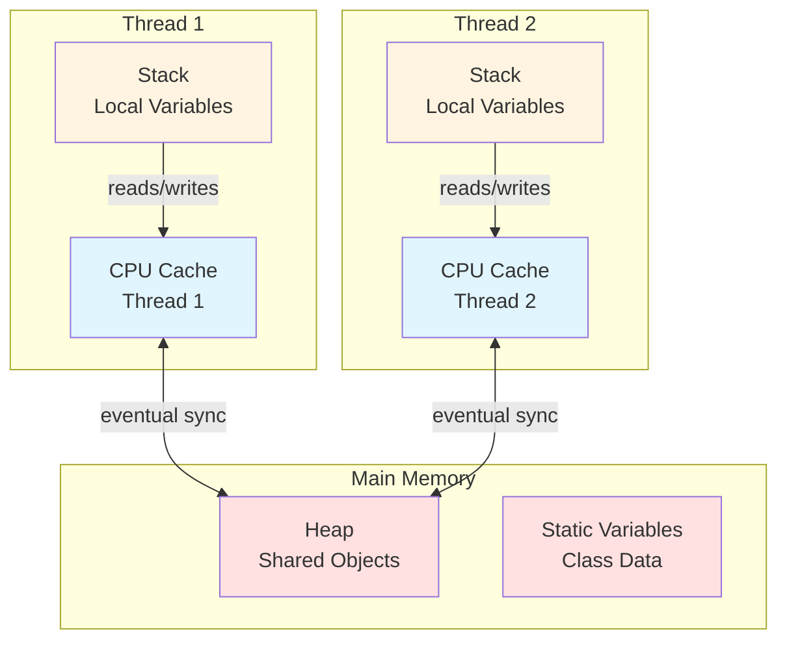
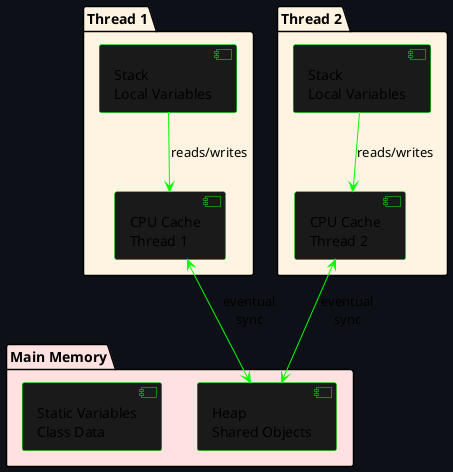
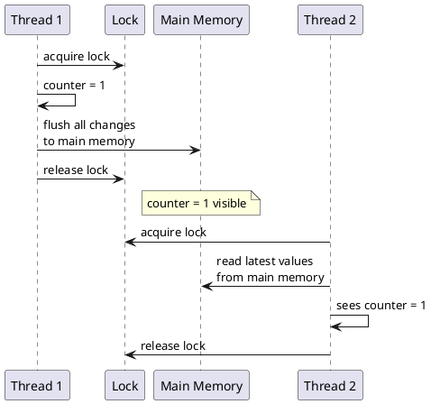
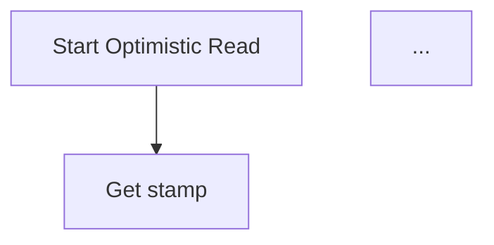
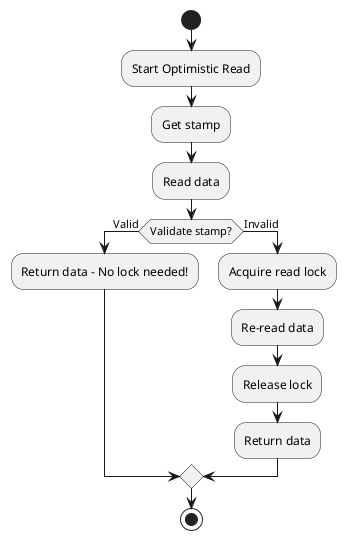
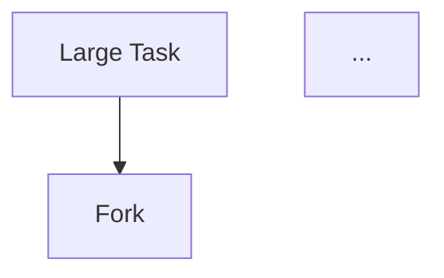
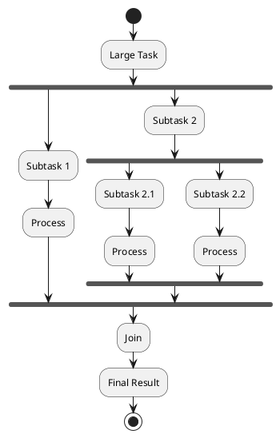
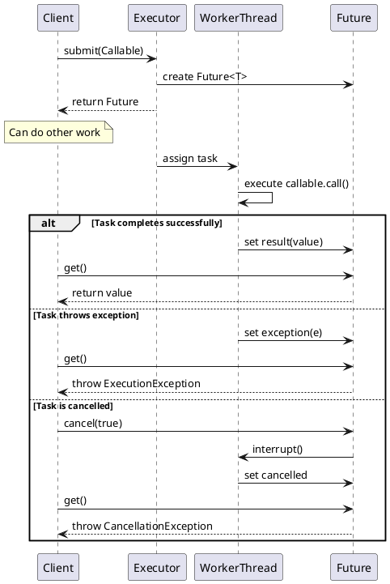

# Diagram Conversion Example: Mermaid → PlantUML

This document shows how to convert the Thread Memory Architecture diagram from Mermaid to PlantUML.

## Original Mermaid Diagram (Not Working)

**File:** `docs/pages/programming/languages/java/java-8/concurrency/java-memory-model.md`

````markdown

````

## Converted PlantUML Version (Working)

### PlantUML Source Code



### How to Generate the Image

**Option 1: Use PlantUML Web Server**

1. Go to: http://www.plantuml.com/plantuml/uml/
2. Paste the PlantUML code above
3. Click "Submit"
4. Copy the generated URL

**Option 2: Use PlantUML Command Line**

```bash
plantuml diagram.puml -tsvg
```

### Markdown Usage

Replace the Mermaid code block with:

```markdown
<!-- PlantUML Source:
@startuml
skinparam backgroundColor #0d1117
skinparam componentBackgroundColor #1a1a1a
skinparam componentBorderColor #00ff00
skinparam arrowColor #00ff00

package "Thread 1" #fff4e1 {
  [Stack\nLocal Variables] as T1Stack
  [CPU Cache\nThread 1] as T1Cache
}

package "Thread 2" #fff4e1 {
  [Stack\nLocal Variables] as T2Stack
  [CPU Cache\nThread 2] as T2Cache
}

package "Main Memory" #ffe1e1 {
  [Heap\nShared Objects] as Heap
  [Static Variables\nClass Data] as Static
}

T1Stack --> T1Cache : reads/writes
T2Stack --> T2Cache : reads/writes
T1Cache <--> Heap : eventual\nsync
T2Cache <--> Heap : eventual\nsync
@enduml
-->


```

## Other Diagram Conversions Needed

### 1. Synchronized Block Sequence (java-memory-model.md)

**Mermaid:**
```mermaid
sequenceDiagram
    participant T1 as Thread 1
    participant Lock
    participant Memory as Main Memory
    participant T2 as Thread 2
    ...
```

**PlantUML:**


### 2. Optimistic Reading Flow (locks-and-conditions.md)

**Mermaid:**


**PlantUML:**


### 3. Divide-and-Conquer (fork-join.md)

**Mermaid:**


**PlantUML:**


### 4. Future Execution Flow (callable-and-future.md)

**Mermaid:**
```mermaid
sequenceDiagram
    participant Client
    participant Executor
    participant WorkerThread
    participant Future
    ...
```

**PlantUML:**


## Summary

**Files to Update:**
1. `java-8/concurrency/java-memory-model.md` - 2 diagrams
2. `java-8/concurrency/locks-and-conditions.md` - 1 diagram
3. `java-8/concurrency/fork-join.md` - 1 diagram
4. `java-8/concurrency/callable-and-future.md` - 1 diagram

**Total:** 5 Mermaid diagrams to convert to PlantUML

**Benefits After Conversion:**
- ✅ Diagrams will render on GitHub Pages
- ✅ No JavaScript required
- ✅ Works in all browsers
- ✅ Can be updated easily via PlantUML web editor
- ✅ Source code preserved in HTML comments

---

See [PLANTUML-SETUP.md](PLANTUML-SETUP.md) for complete PlantUML documentation.
