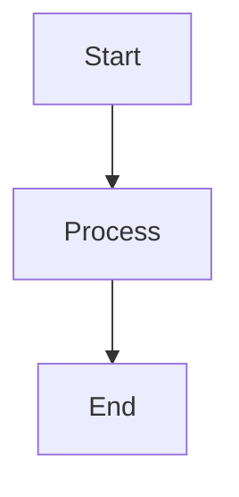
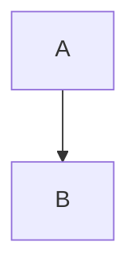

# Mermaid Diagram Support

This project now supports **Mermaid.js** diagrams in GitHub Pages.

## What Was Done

### Solution Implemented: Custom Layout with Mermaid.js

Created a custom Jekyll layout that extends the Hacker theme and adds Mermaid rendering:

**Files Added:**
- `docs/_layouts/default.html` - Custom layout with Mermaid.js integration (traditional script loading)
- `docs/_includes/head-custom.html` - Custom head elements placeholder
- `docs/_includes/mermaid.html` - Alternative include for per-page Mermaid loading
- `docs/mermaid-test.md` - Test page with sample diagrams
- `docs/_config.yml` - Updated with Kramdown markdown settings

**How It Works:**
1. The custom layout overrides the default Hacker theme layout
2. Mermaid.js v10 is loaded from CDN using traditional script tag (more compatible than ES modules)
3. Configured with dark theme colors matching the Hacker theme aesthetic
4. Automatically initializes on page load with DOMContentLoaded event

## Using Mermaid Diagrams

Simply use standard markdown code blocks with `mermaid` language identifier:

````markdown

````

## Theme Configuration

The Mermaid theme is configured to match the Hacker theme:
- **Theme**: Dark mode
- **Primary Color**: Green (#00ff00)
- **Background**: Dark (#1a1a1a)
- **Text**: White

## Existing Diagrams

Mermaid diagrams are used in:
- `docs/pages/programming/languages/java/java-8/concurrency/java-memory-model.md`
- `docs/pages/programming/languages/java/java-8/concurrency/locks-and-conditions.md`
- `docs/pages/programming/languages/java/java-8/concurrency/fork-join.md`
- `docs/pages/programming/languages/java/java-8/concurrency/callable-and-future.md`

## Testing

After deploying to GitHub Pages, verify diagrams render correctly by visiting any page with Mermaid diagrams.

## Alternative Solutions (Not Implemented)

If you need different Mermaid configuration or encounter issues:

### Option 1: Different Mermaid Version
Edit `docs/_layouts/default.html` and change the CDN URL:
```javascript
import mermaid from 'https://cdn.jsdelivr.net/npm/mermaid@11/dist/mermaid.esm.min.mjs';
```

### Option 2: Light Theme
Change theme configuration in `docs/_layouts/default.html`:
```javascript
mermaid.initialize({
  startOnLoad: true,
  theme: 'default'  // or 'forest', 'neutral'
});
```

### Option 3: Pre-render to Images (Build-time)
If you want to avoid runtime JavaScript:
1. Use `mermaid-cli` to generate PNG/SVG images
2. Replace mermaid code blocks with image references
3. Commit generated images to repository

### Option 4: Use GitHub's Native Mermaid (Markdown only)
GitHub README files support Mermaid natively, but GitHub Pages doesn't automatically. Our custom layout provides this functionality.

## Testing

**Test Page:** Visit `/mermaid-test.html` on your GitHub Pages site to verify Mermaid is working.

Example: `https://ggranados.github.io/data-driven-docs/mermaid-test`

If diagrams render on the test page, Mermaid is configured correctly.

## Troubleshooting

**Diagrams not rendering:**
1. **Check browser console** for JavaScript errors (F12 → Console tab)
2. **Verify GitHub Pages deployment** completed (Settings → Pages → last deployment time)
3. **Clear browser cache** (Ctrl+Shift+R or Cmd+Shift+R)
4. **Check syntax**: Ensure mermaid code blocks use ` ```mermaid ` (not `~~~mermaid`)
5. **Wait for rebuild**: GitHub Pages can take 1-5 minutes to rebuild after push

**If global layout isn't working, use per-page include:**

Add this to the top of pages that need Mermaid:

```markdown
---
layout: default
---



# Your Page Title


```

This manually loads Mermaid on specific pages only.

**Styling issues:**
- Edit theme colors in `docs/_layouts/default.html`
- Adjust `themeVariables` object
- Check CSS conflicts with theme

**Performance concerns:**
- Mermaid loads from CDN (may be slow on first load)
- Consider self-hosting mermaid.js for faster loads
- Use `<pre class="mermaid">` for manual initialization if needed

## References

- [Mermaid.js Documentation](https://mermaid.js.org/)
- [Mermaid Live Editor](https://mermaid.live/) - Test diagrams
- [Mermaid Themes](https://mermaid.js.org/config/theming.html)

---

**Implementation Date:** 2025-11-13
**Mermaid Version:** 10.x (ES Module)
**Jekyll Theme:** Hacker (pages-themes/hacker)
