# PlantUML Diagram Support

**PlantUML** is the recommended solution for diagrams in this GitHub Pages project.

## Why PlantUML Over Mermaid?

✅ **No JavaScript Required**: Renders as static images
✅ **Works Everywhere**: GitHub Pages, README files, all browsers
✅ **Reliable**: Uses PlantUML server to generate images
✅ **More Features**: Supports more diagram types than Mermaid
✅ **No Build Step**: Images generated on-the-fly via URL

## How PlantUML Works

PlantUML uses a **server-based approach**:
1. Write PlantUML code
2. Encode it as a URL-safe string
3. Use PlantUML server URL to generate image
4. Embed image in markdown

The image is generated **dynamically** by the PlantUML server and cached.

## Quick Start

### Method 1: Use PlantUML Web Server (Recommended)

**Step 1:** Write your diagram in PlantUML syntax:

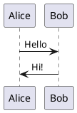

**Step 2:** Go to http://www.plantuml.com/plantuml/uml/ and paste your code

**Step 3:** Copy the generated image URL

**Step 4:** Use in markdown:

```markdown

```

### Method 2: Manual URL Encoding

For programmatic generation, encode PlantUML to URL:

```markdown

```

Where `ENCODED_STRING` is your PlantUML code encoded in PlantUML's deflate format.

**Online Encoder:** http://www.plantuml.com/plantuml/

## PlantUML Syntax Examples

### Sequence Diagram

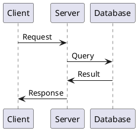

**Renders as:**


### Class Diagram

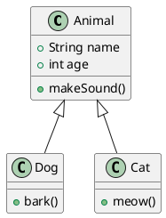

### Activity Diagram (Flowchart)

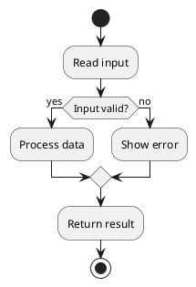

### Component Diagram

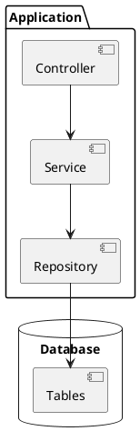

### State Diagram

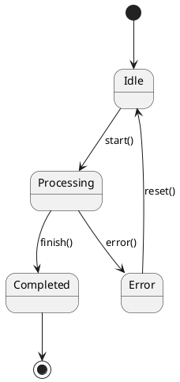

## Converting Mermaid to PlantUML

### Mermaid Flowchart
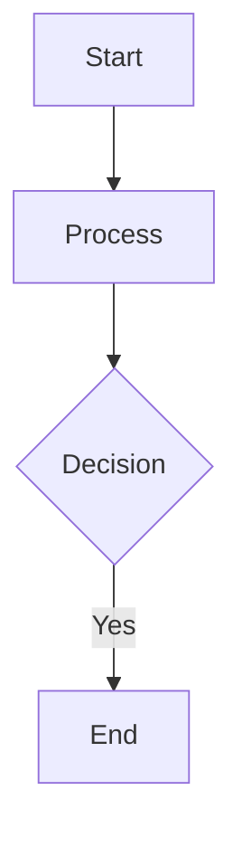

### PlantUML Equivalent
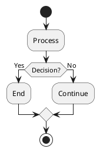

## Best Practices

### 1. Use SVG Format (Recommended)

```markdown

```

Benefits:
- Scales infinitely
- Smaller file size
- Crisp on all displays

### 2. Add Alt Text for Accessibility

```markdown

```

### 3. Keep Diagrams Simple

- One diagram per concept
- Limit to 10-15 elements
- Use clear labels

### 4. Use Consistent Styling

Add to diagrams for consistent theming:

```plantuml
@startuml
skinparam backgroundColor #0d1117
skinparam arrowColor #00ff00
skinparam classBorderColor #00ff00
skinparam classBackgroundColor #1a1a1a

' Your diagram here
@enduml
```

### 5. Version Control Friendly

Store PlantUML source in comments:

```markdown
<!-- PlantUML Source:
@startuml
Alice -> Bob: Hello
@enduml
-->

```

## Tools and Editors

### Online Editors
- **PlantUML Web Server**: http://www.plantuml.com/plantuml/
- **PlantText**: https://www.planttext.com/
- **PlantUML QEditor**: https://github.com/tmorin/plantuml-editor

### IDE Plugins
- **VS Code**: PlantUML extension
- **IntelliJ IDEA**: PlantUML integration plugin
- **Eclipse**: PlantUML plugin

### Local Rendering
```bash
# Install PlantUML locally (requires Java)
brew install plantuml  # macOS
apt install plantuml   # Linux

# Generate diagram
plantuml diagram.puml
```

## Converting Existing Diagrams

For the existing Mermaid diagrams in this project:

### 1. Thread Memory Architecture
**File:** `java-8/concurrency/java-memory-model.md`

**Original Mermaid:**
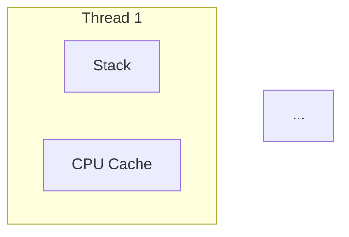

**PlantUML Version:**
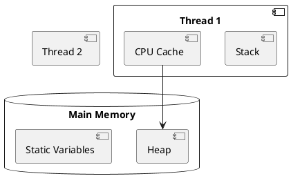

### 2. Lock/Synchronization Flow
Can use PlantUML sequence diagrams (superior to Mermaid for this)

### 3. Fork/Join Pattern
Use PlantUML activity diagrams

## Server Options

### Public Servers (Free)
- **Official**: `http://www.plantuml.com/plantuml/`
- **GitHub**: Unofficial PlantUML proxy servers

### Self-Hosted (Advanced)
```bash
# Docker
docker run -d -p 8080:8080 plantuml/plantuml-server

# Then use: http://localhost:8080/plantuml/svg/...
```

### Privacy Considerations
- Public servers can see your diagram code
- Use self-hosted server for sensitive diagrams
- Diagrams are cached but code is not stored permanently

## Advantages Over Other Solutions

| Feature | PlantUML | Mermaid | Static Images |
|---------|----------|---------|---------------|
| **No JavaScript** | ✅ | ❌ | ✅ |
| **GitHub README** | ✅ | ❌ | ✅ |
| **GitHub Pages** | ✅ | ⚠️ | ✅ |
| **Text-based** | ✅ | ✅ | ❌ |
| **Version Control** | ✅ | ✅ | ❌ |
| **Diagram Types** | Many | Limited | N/A |
| **Customization** | High | Medium | N/A |

## Migration Plan

1. Identify all Mermaid diagrams in project
2. Convert to PlantUML syntax
3. Generate PlantUML server URLs
4. Replace Mermaid code blocks with image links
5. Add PlantUML source in HTML comments for future editing

## Example: Complete Migration

**Before (Mermaid - Not Working):**
````markdown
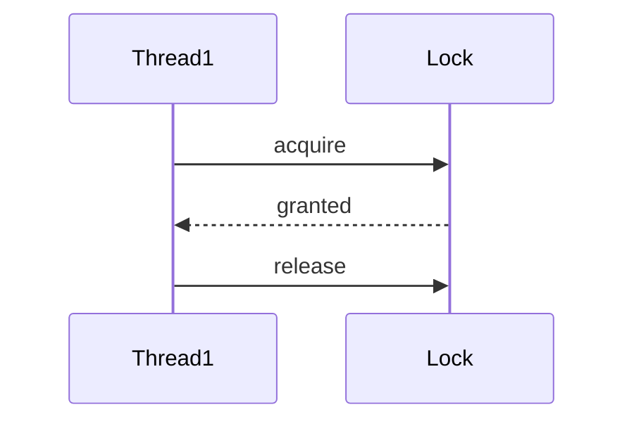
````

**After (PlantUML - Works):**
```markdown
<!-- PlantUML Source:
@startuml
Thread1 -> Lock: acquire
Lock --> Thread1: granted
Thread1 -> Lock: release
@enduml
-->

```

## Resources

**Official Documentation:**
- https://plantuml.com/
- https://plantuml.com/guide

**Diagram Types:**
- Sequence: https://plantuml.com/sequence-diagram
- Class: https://plantuml.com/class-diagram
- Activity: https://plantuml.com/activity-diagram-beta
- Component: https://plantuml.com/component-diagram
- State: https://plantuml.com/state-diagram

**Cheat Sheets:**
- https://ogom.github.io/draw_uml/plantuml/
- https://plantuml-documentation.readthedocs.io/

---

**Recommendation:** PlantUML is the most reliable solution for GitHub Pages diagrams. It requires no JavaScript, works everywhere, and provides more diagram types than Mermaid.

