# Data-Driven-Docs Enhancement Plan

**Created:** 2025-11-13
**Status:** Proposed
**Version:** 1.0

---

## Table of Contents

<!-- TOC -->
* [Data-Driven-Docs Enhancement Plan](#data-driven-docs-enhancement-plan)
  * [Table of Contents](#table-of-contents)
  * [Executive Summary](#executive-summary)
  * [Current State Analysis](#current-state-analysis)
    * [Content Maturity Statistics](#content-maturity-statistics)
    * [Key Findings](#key-findings)
  * [Enhancement Proposals](#enhancement-proposals)
    * [1. Content Completion & Gap Filling](#1-content-completion--gap-filling)
    * [2. Interactive Learning Features](#2-interactive-learning-features)
    * [3. Enhanced Navigation & Discovery](#3-enhanced-navigation--discovery)
    * [4. Visual Enhancements](#4-visual-enhancements)
    * [5. Real-World Context](#5-real-world-context)
    * [6. Search & Discoverability](#6-search--discoverability)
    * [7. Community & Contribution Features](#7-community--contribution-features)
    * [8. Cross-Reference Improvements](#8-cross-reference-improvements)
    * [9. Mobile & Accessibility](#9-mobile--accessibility)
    * [10. Version-Specific Content](#10-version-specific-content)
    * [11. Performance & Technical Improvements](#11-performance--technical-improvements)
    * [12. Analytics & Insights](#12-analytics--insights)
  * [Implementation Priority Matrix](#implementation-priority-matrix)
    * [Quick Wins (Low effort, High impact)](#quick-wins-low-effort-high-impact)
    * [High Priority (Medium effort, High impact)](#high-priority-medium-effort-high-impact)
    * [Long Term (High effort, High impact)](#long-term-high-effort-high-impact)
    * [Nice to Have (Low effort, Medium impact)](#nice-to-have-low-effort-medium-impact)
  * [Implementation Roadmap](#implementation-roadmap)
    * [Phase 1: Foundation (Weeks 1-2)](#phase-1-foundation-weeks-1-2)
    * [Phase 2: Content Enrichment (Weeks 3-4)](#phase-2-content-enrichment-weeks-3-4)
    * [Phase 3: User Experience (Weeks 5-6)](#phase-3-user-experience-weeks-5-6)
    * [Phase 4: Community & Growth (Weeks 7-8)](#phase-4-community--growth-weeks-7-8)
  * [Detailed Enhancement Specifications](#detailed-enhancement-specifications)
  * [Appendix: Research & Resources](#appendix-research--resources)
<!-- TOC -->

---

## Executive Summary

This enhancement plan proposes strategic improvements to the Data-Driven-Docs educational repository based on comprehensive analysis of existing content. The plan focuses on:

1. **Completing critical content gaps** - Particularly Java concurrency and security topics
2. **Enhancing learning experience** - Interactive features, learning paths, and better navigation
3. **Improving discoverability** - Search, tagging, and cross-referencing
4. **Building community** - Contribution templates and feedback mechanisms
5. **Modernizing presentation** - Mermaid diagrams, responsive design, accessibility

**Current Status:**
- 60+ markdown documents across 11 major topic categories
- ~40% well-developed content, 30% partial, 10% placeholder-only
- Strong Java 8+ and RESTful API coverage
- 34 TODO placeholders and 4 completely empty files

**Expected Outcomes:**
- 100% completion of referenced topics (eliminate broken links)
- 3-5 curated learning paths for different developer personas
- 50% improvement in content discoverability via search and navigation
- Active contributor community with clear guidelines

---

## Current State Analysis

### Content Maturity Statistics

**Total Documentation:**
- 58 markdown files
- 8 main topic categories
- 21 directory levels
- 32 diagrams/images

**Content Distribution:**
- ✅ **Complete (20%)**: SOLID, ACID, Stream API, Lambda Expressions, JWT, OAuth
- 🔄 **Well-developed (40%)**: Most Java 8+ topics, RESTful design, DBMS concepts
- ⚠️ **Partial (30%)**: Functional programming, Microservices (with TODOs)
- ❌ **Placeholder (10%)**: Java concurrency sub-topics (4 empty files)

**Content Types:**
- Heavy code examples (Java, JavaScript, Python, HTTP/JSON)
- 32 diagrams (technical flows, architecture, concepts)
- Text-based explanations with emphasis blocks
- External reference links to official documentation

### Key Findings

#### Strengths ✅
1. **Java 8+ content** - Extremely comprehensive with rich examples and diagrams
   - stream-api.md: 1069 lines with 6 diagrams
   - project-reactor.md: 1237 lines (most comprehensive)
   - lambda-expression.md, optional.md: Well-structured
2. **RESTful API design** - Practical examples and best practices
3. **Visual aids** - Consistent use of diagrams to enhance understanding
4. **Code examples** - Real-world, runnable code across topics
5. **Consistent structure** - Template followed well in completed pages

#### Critical Gaps ❌
1. **Java Concurrency** - 4 completely empty files (high-priority topic):
   - `executors.md`
   - `callable-and-future.md`
   - `completable-future.md`
   - `java-memory-model.md`
2. **API Tooling** - OpenAPI/Swagger (9 TODO references across pages)
3. **Security** - SQL Injection, XSS prevention content missing
4. **Advanced Patterns** - Event Sourcing, Message-Driven, Distributed Transactions
5. **Infrastructure** - Caching strategies incomplete (3 references)

#### Opportunities 🎯
1. **Strong foundation** - Can build on excellent Java and API content
2. **Clear structure** - Easy to replicate successful patterns
3. **Active development** - Recent commits show ongoing work
4. **Navigation hub** - get-started.md provides central organization
5. **Utility tooling** - Java validation tool can be enhanced

---

## Enhancement Proposals

### 1. Content Completion & Gap Filling

#### Priority 1: High-Impact Missing Content

**Java Concurrency (Critical)**
- **Files to create:** 4 empty placeholders currently breaking links
  - `docs/pages/programming/languages/java/java-8/concurrency/executors.md`
  - `docs/pages/programming/languages/java/java-8/concurrency/callable-and-future.md`
  - `docs/pages/programming/languages/java/java-8/concurrency/completable-future.md`
  - `docs/pages/programming/languages/java/java-8/concurrency/java-memory-model.md`
- **Content requirements:**
  - Code examples for thread pools, executor services
  - Diagrams showing thread lifecycle and memory model
  - Comparison tables (Future vs CompletableFuture)
  - Best practices and common pitfalls
- **Impact:** Completes a frequently referenced section, eliminates 4+ broken links
- **Effort:** Medium (4-6 hours per file)

**API Documentation Tools**
- **Files to create:**
  - `docs/pages/ws-and-api-design/openapi-swagger.md`
  - `docs/pages/ws-and-api-design/api-documentation.md`
- **Content requirements:**
  - OpenAPI 3.0 specification examples
  - Swagger UI integration guide
  - YAML/JSON schema examples
  - Links to Swagger Editor, Postman
- **Impact:** Resolves 9 TODO references across RESTful API pages
- **Effort:** Medium (3-4 hours)

**Security Essentials**
- **Files to create:**
  - `docs/pages/cyber-security/web-security/sql-injection.md`
  - `docs/pages/cyber-security/web-security/xss-prevention.md`
  - `docs/pages/cyber-security/owasp-top-10.md`
- **Content requirements:**
  - Attack vectors with code examples
  - Prevention techniques (parameterized queries, input sanitization)
  - Framework-specific guidance (Spring Security, OWASP Java Encoder)
  - OWASP resources links
- **Impact:** Critical for web developers, addresses security TODOs in API design
- **Effort:** Medium (2-3 hours per topic)

#### Priority 2: Expand Strong Areas

**Advanced Reactive Patterns** (build on excellent Project Reactor content)
- **New content sections:**
  - Backpressure handling strategies
  - Error handling in reactive streams
  - Testing reactive code (StepVerifier)
  - Reactor vs RxJava comparison
- **Enhancement to:** `docs/pages/programming/languages/java/java-8/project-reactor.md`
- **Impact:** Deepens already strong reactive programming coverage
- **Effort:** Low (add to existing file)

**Microservices Patterns** (complete 3 TODOs)
- **Files to create:**
  - `docs/pages/architectural-patterns/distributed-transactions.md`
  - `docs/pages/architectural-patterns/saga-pattern.md`
  - `docs/pages/architectural-patterns/event-sourcing.md`
  - `docs/pages/architectural-patterns/message-driven.md`
- **Content requirements:**
  - Pattern descriptions with diagrams
  - Use cases and trade-offs
  - Implementation examples (Spring Cloud, Axon Framework)
  - Links to microservices.md
- **Impact:** Completes architectural patterns section
- **Effort:** Medium (3-4 hours per pattern)

**Caching Strategies**
- **Files to create:**
  - `docs/pages/ws-and-api-design/caching-strategies.md`
- **Content requirements:**
  - HTTP caching headers (Cache-Control, ETag, Last-Modified)
  - Application-level caching (Redis, Memcached)
  - CDN caching strategies
  - Cache invalidation patterns
- **Impact:** Resolves 3 TODO references in RESTful API docs
- **Effort:** Low-Medium (2-3 hours)

---

### 2. Interactive Learning Features

#### Code Playgrounds

**Embedded Interactive Examples**

Add runnable code snippets for hands-on learning:

```markdown
## Try It Yourself: Stream API

<iframe src="https://jdoodle.com/embed/v0/..."
        width="100%"
        height="400px"
        frameborder="0">
</iframe>
```

**Implementation Options:**
- **JDoodle** - Java code execution
- **CodePen/JSFiddle** - JavaScript examples
- **Repl.it** - Multi-language support

**Target Topics:**
- Java Stream API examples
- Lambda expressions
- Functional programming (JavaScript)
- RESTful API request examples

**Benefits:**
- Hands-on practice without local setup
- Immediate feedback for learners
- Lower barrier to experimentation

**Effort:** Low (1 hour per page to add embeds)

#### Quick Quiz Sections

**Self-Assessment Questions**

Add expandable quiz questions at the end of major topics:

```markdown
## Knowledge Check

<details>
<summary>1. What does the 'A' in ACID stand for?</summary>

**Answer:** Atomicity

Atomicity ensures that a transaction is treated as a single, indivisible unit of work.
</details>

<details>
<summary>2. When should you use a Stream instead of a Collection?</summary>

**Answer:** Use Streams when:
- Processing data with functional-style operations
- Lazy evaluation is beneficial
- Parallel processing might improve performance
- You want declarative, readable code
</details>

<details>
<summary>3. What's the difference between intermediate and terminal operations?</summary>

**Answer:**
- **Intermediate operations** are lazy and return a new Stream (map, filter, sorted)
- **Terminal operations** trigger execution and return a result (collect, forEach, reduce)
</details>
```

**Target Topics:**
- ACID, BASE, CAP theorem
- Stream API
- SOLID principles
- OAuth/JWT authentication
- RESTful API design

**Benefits:**
- Active recall improves retention
- Self-paced learning validation
- Identifies knowledge gaps

**Effort:** Low (30 minutes per topic, 3-5 questions each)

#### Comparison Tables

**Visual Decision Aids**

Add structured comparisons for related concepts:

```markdown
## SQL vs NoSQL: Quick Comparison

| Aspect | SQL (Relational) | NoSQL |
|--------|------------------|-------|
| **Data Structure** | Tables with fixed schema | Flexible documents/key-value/graphs |
| **Scalability** | Vertical (scale-up) | Horizontal (scale-out) |
| **ACID Compliance** | Full ACID guarantees | BASE (eventual consistency) |
| **Query Language** | SQL (standardized) | Varies by database |
| **Best For** | Complex queries, transactions | High-volume, unstructured data |
| **Examples** | PostgreSQL, MySQL | MongoDB, Cassandra, Redis |

[Learn more: ACID](acid.md) | [Learn more: BASE](base.md)
```

**Other Comparison Topics:**
- Design patterns (Strategy vs Template Method vs Command)
- Java version features timeline
- REST vs GraphQL vs gRPC
- Microservices vs Monolithic
- Different isolation levels

**Benefits:**
- Quick reference for decision-making
- Highlights trade-offs clearly
- Improves navigation between topics

**Effort:** Low-Medium (1-2 hours per comparison table)

---

### 3. Enhanced Navigation & Discovery

#### Learning Paths

**Curated Tracks for Different Personas**

Create guided learning sequences in `docs/get-started.md`:

```markdown
## 📚 Learning Paths

### 🔷 Backend Java Developer Track
**Goal:** Master enterprise Java development with Spring ecosystem

1. **Foundations**
   - [Java Platform Overview](pages/programming/languages/java/java.md)
   - [OOP Principles](pages/programming/paradigms/object-oriented.md)
   - [SOLID Principles](pages/design-patterns/solid.md)

2. **Modern Java**
   - [Java 5: Generics & Collections](pages/programming/languages/java/java-5/enhanced-collections.md)
   - [Java 8: Lambda Expressions](pages/programming/languages/java/java-8/lambda-expression.md)
   - [Java 8: Stream API](pages/programming/languages/java/java-8/stream-api.md)
   - [Java 8: Optional](pages/programming/languages/java/java-8/optional.md)

3. **Concurrency & Reactive**
   - [Java Concurrency](pages/programming/languages/java/java-8/concurrency.md)
   - [CompletableFuture](pages/programming/languages/java/java-8/concurrency/completable-future.md)
   - [Project Reactor](pages/programming/languages/java/java-8/project-reactor.md)

4. **Architecture & Patterns**
   - [Dependency Injection](pages/design-patterns/solid.md#dependency-inversion)
   - [Observer Pattern](pages/design-patterns/behavioral/observer.md)
   - [Microservices](pages/architectural-patterns/microservices.md)
   - [Reactive Systems](pages/architectural-patterns/reactive.md)

5. **Data & Persistence**
   - [ACID Transactions](pages/dbms/acid.md)
   - [Relational Databases](pages/dbms/relational.md)
   - [NoSQL](pages/dbms/nosql.md)

**Estimated Time:** 40-50 hours

---

### 🌐 Web API Developer Track
**Goal:** Design and implement RESTful APIs with security best practices

1. **API Fundamentals**
   - [RESTful Architecture](pages/ws-and-api-design/restful.md)
   - [Resource Design](pages/ws-and-api-design/restful/resource-design-representation.md)
   - [API Design Principles](pages/ws-and-api-design/restful/api-design-principles.md)

2. **Implementation**
   - [RESTful API Design](pages/ws-and-api-design/restful/restful-api-design.md)
   - [HTTP Methods & Status Codes](pages/ws-and-api-design/restful.md)
   - [OpenAPI & Swagger](pages/ws-and-api-design/openapi-swagger.md) ⏳

3. **Security**
   - [Authentication & Authorization](pages/ws-and-api-design/authn-and-authz/authn-authz.md)
   - [OAuth 2.0](pages/ws-and-api-design/authn-and-authz/oauth.md)
   - [JWT](pages/ws-and-api-design/authn-and-authz/jwt.md)
   - [OpenID Connect](pages/ws-and-api-design/authn-and-authz/openid-connect.md)

4. **Data Layer**
   - [Database Concepts](pages/dbms/acid.md)
   - [SQL vs NoSQL](pages/dbms/relational.md)

5. **Advanced Topics**
   - [Caching Strategies](pages/ws-and-api-design/caching-strategies.md) ⏳
   - [API Security](pages/cyber-security/web-security/sql-injection.md) ⏳
   - [Microservices Communication](pages/architectural-patterns/microservices.md)

**Estimated Time:** 30-40 hours

---

### ⚛️ Frontend Developer Track
**Goal:** Build modern web applications with API integration

1. **Web Foundations**
   - [HTML/CSS/JavaScript Basics](pages/programming/languages/) ⏳
   - [Declarative Programming](pages/programming/paradigms/declarative.md)
   - [Functional Programming](pages/programming/paradigms/functional.md)

2. **Reactive Programming**
   - [Reactive Programming Concepts](pages/programming/paradigms/reactive.md)
   - [Observer Pattern](pages/design-patterns/behavioral/observer.md)

3. **API Integration**
   - [RESTful APIs](pages/ws-and-api-design/restful.md)
   - [OAuth 2.0 Client](pages/ws-and-api-design/authn-and-authz/oauth.md)
   - [JWT Handling](pages/ws-and-api-design/authn-and-authz/jwt.md)

4. **Security**
   - [XSS Prevention](pages/cyber-security/web-security/xss-prevention.md) ⏳
   - [CORS](pages/ws-and-api-design/restful.md) ⏳

**Estimated Time:** 25-35 hours

---

### 🔧 DevOps Engineer Track
**Goal:** Implement CI/CD and infrastructure automation

1. **Architecture Understanding**
   - [Microservices](pages/architectural-patterns/microservices.md)
   - [Reactive Systems](pages/architectural-patterns/reactive.md)
   - [Message-Driven Architecture](pages/architectural-patterns/message-driven.md) ⏳

2. **Infrastructure**
   - [Cloud Platforms](pages/get-started.md#cloud-computing-platform)
   - [Containerization](pages/get-started.md#devops-practices) ⏳
   - [Infrastructure as Code](pages/get-started.md#devops-practices) ⏳

3. **Databases**
   - [CAP Theorem](pages/dbms/cap.md)
   - [SQL vs NoSQL](pages/dbms/relational.md)
   - [Distributed Databases](pages/dbms/) ⏳

4. **Security**
   - [IAM](pages/cyber-security/access-control-and-authn/iam.md)
   - [Security Best Practices](pages/cyber-security/) ⏳

**Estimated Time:** 35-45 hours

---

### 🏗️ Software Architect Track
**Goal:** Design scalable, maintainable systems

1. **Design Principles**
   - [SOLID Principles](pages/design-patterns/solid.md)
   - [Design Patterns](pages/design-patterns/)
   - [OOP vs Functional](pages/programming/paradigms/)

2. **Architectural Patterns**
   - [Microservices](pages/architectural-patterns/microservices.md)
   - [Reactive Systems](pages/architectural-patterns/reactive.md)
   - [Event Sourcing](pages/architectural-patterns/event-sourcing.md) ⏳
   - [CQRS](pages/architectural-patterns/) ⏳

3. **Distributed Systems**
   - [CAP Theorem](pages/dbms/cap.md)
   - [Distributed Transactions](pages/architectural-patterns/distributed-transactions.md) ⏳
   - [Saga Pattern](pages/architectural-patterns/saga-pattern.md) ⏳

4. **API Design**
   - [RESTful Design](pages/ws-and-api-design/restful/restful-api-design.md)
   - [API Versioning](pages/ws-and-api-design/restful/restful-api-design.md#versioning-apis)
   - [HATEOAS](pages/ws-and-api-design/restful/restful-api-design.md#hateoas)

5. **Data Architecture**
   - [ACID vs BASE](pages/dbms/)
   - [Polyglot Persistence](pages/dbms/nosql.md)

**Estimated Time:** 50-60 hours

---

Legend:
- ✅ Complete content
- ⏳ Planned/TODO
```

**Benefits:**
- Reduces overwhelming choice for new learners
- Provides clear progression path
- Aligns with career goals
- Estimated time helps planning

**Effort:** Low (3-4 hours to create all paths)

#### Topic Difficulty Indicators

**Visual Complexity Badges**

Add difficulty level badges using shields.io:

```markdown
# Stream API


# Lambda Expressions


# Project Reactor


```

**Difficulty Levels:**
- 🟢 **Beginner** - No prerequisites, fundamental concepts
- 🟡 **Intermediate** - Requires basic knowledge, practical application
- 🔴 **Advanced** - Complex topics, multiple prerequisites

**Implementation:**
- Add to all 60+ existing pages
- Include in template.md for consistency
- Display in navigation/TOC

**Effort:** Low (5-10 minutes per page, ~10 hours total)

#### "Related Topics" Sections

**Systematic Cross-Referencing**

Add structured "Related Topics" section at the end of each document:

```markdown
---

## Related Topics

### Prerequisites
- [Java Collections Framework](../java-5/enhanced-collections.md) - Understanding of List, Set, Map interfaces
- [Functional Programming Basics](../../paradigms/functional.md) - Lambda expressions and functional interfaces

### Next Steps
- [Optional API](optional.md) - Handling null values in functional style
- [Parallel Streams](stream-api.md#parallel-streams) - Performance optimization with parallel processing
- [Collectors](stream-api.md#collectors) - Advanced result gathering techniques

### Related Patterns
- [Functional Programming Paradigm](../../paradigms/functional.md) - Declarative data processing
- [Iterator Pattern](../../design-patterns/behavioral/) ⏳ - Alternative approach to collection traversal
- [Observer Pattern](../../design-patterns/behavioral/observer.md) - Event-driven data processing

### Deep Dives
- [Project Reactor](project-reactor.md) - Reactive streams for asynchronous processing
- [CompletableFuture](concurrency/completable-future.md) ⏳ - Asynchronous computation
- [RxJava]() ⏳ - Alternative reactive library

### Official Resources
- [Java Stream API Javadoc](https://docs.oracle.com/javase/8/docs/api/java/util/stream/Stream.html)
- [Java Tutorials: Stream API](https://docs.oracle.com/javase/tutorial/collections/streams/)

---

[Get Started](../../get-started.md) | [Java Topics](java.md) | [Back to top](#table-of-contents)
```

**Benefits:**
- Contextualizes current topic in larger ecosystem
- Suggests natural learning progression
- Improves SEO through internal linking
- Reduces orphaned content

**Effort:** Medium (20-30 minutes per page, ~30 hours total)

#### Progress Tracker

**Visual Completion Status**

Add dynamic progress indicator showing topic coverage:

```markdown
## 📊 Topic Completion Status

### Programming
- ✅ Java 8+ Features (95% complete)
  - ✅ Lambda Expressions
  - ✅ Stream API
  - ✅ Optional
  - ✅ Functional Interfaces
  - 🔄 Concurrency (40% - 4 pages in progress)
- ✅ Paradigms (85% complete)
  - ✅ OOP, Functional, Reactive
  - ⏳ Logic Programming (planned)

### Database Management
- ✅ Concepts (100% complete)
  - ✅ ACID, BASE, CAP Theorem
- ✅ Relational Databases (90%)
  - ✅ SQL Basics
  - ⏳ Advanced Queries (planned)
- ✅ NoSQL (80%)

### Web Services & API Design
- ✅ RESTful Architecture (85%)
  - ✅ API Design Principles
  - ✅ Resource Design
  - ⏳ OpenAPI/Swagger (in progress)
  - ⏳ Caching (in progress)
- ✅ Authentication (100%)
  - ✅ OAuth 2.0, JWT, SAML, OpenID Connect

### Design Patterns
- 🔄 Patterns (35% complete)
  - ✅ SOLID Principles
  - ✅ Observer Pattern
  - ⏳ 10 more patterns (planned)

### Architectural Patterns
- 🔄 Patterns (60% complete)
  - ✅ Microservices, Reactive Systems
  - ⏳ Event Sourcing, Saga, CQRS (in progress)

### Cyber-security
- ⏳ Fundamentals (20% complete)
  - ✅ IAM
  - ⏳ OWASP Top 10 (planned)
  - ⏳ Web Security (planned)

### Overall Completion: 68% ████████████░░░░░░░░

Legend:
- ✅ Complete & reviewed
- 🔄 In progress
- ⏳ Planned / TODO
- Percentage indicates pages completed vs planned
```

**Update Location:**
- Main page: `docs/index.md`
- Category pages: Add mini progress bars
- Auto-generate from file analysis

**Benefits:**
- Transparency for contributors
- Motivation through visible progress
- Helps prioritize gaps
- Tracks project health

**Effort:** Medium (4-6 hours to create + automation script)

---

### 4. Visual Enhancements

#### Standardized Diagrams with Mermaid.js

**Replace Static Images with Code-Based Diagrams**

GitHub supports Mermaid.js natively for maintainable, version-controlled diagrams:

**Example 1: OAuth Flow**
```markdown
## OAuth 2.0 Authorization Code Flow

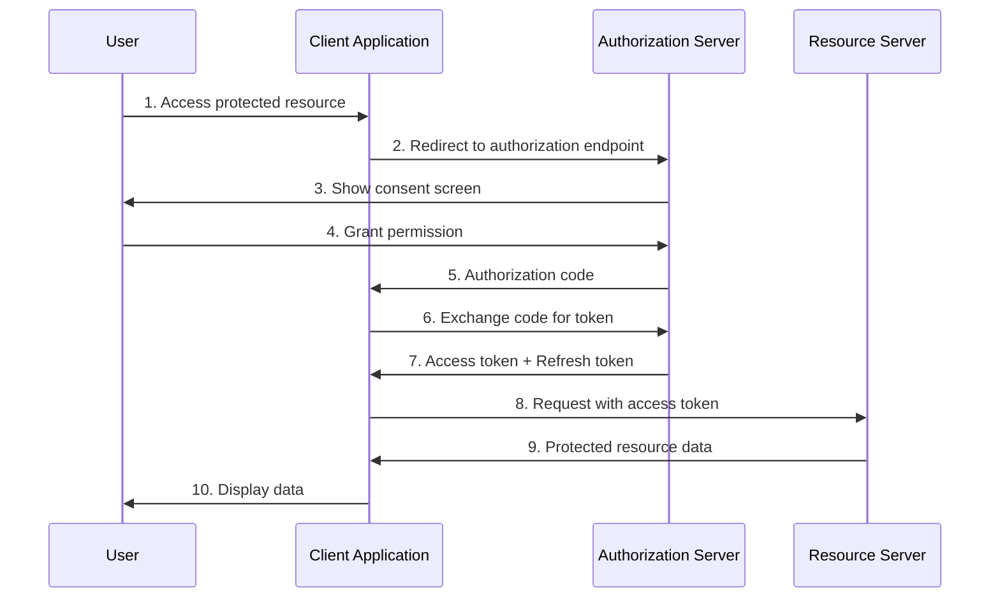
```

**Example 2: Stream Processing Pipeline**
```markdown
## Stream Operations Flow

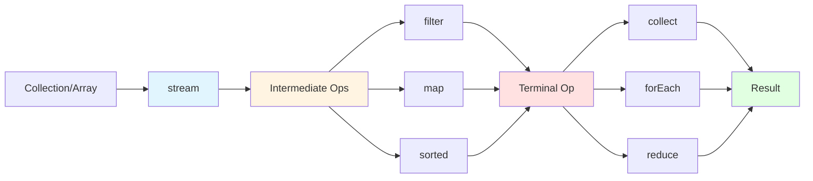
```

**Example 3: Microservices Architecture**
```markdown
## Microservices Communication Pattern

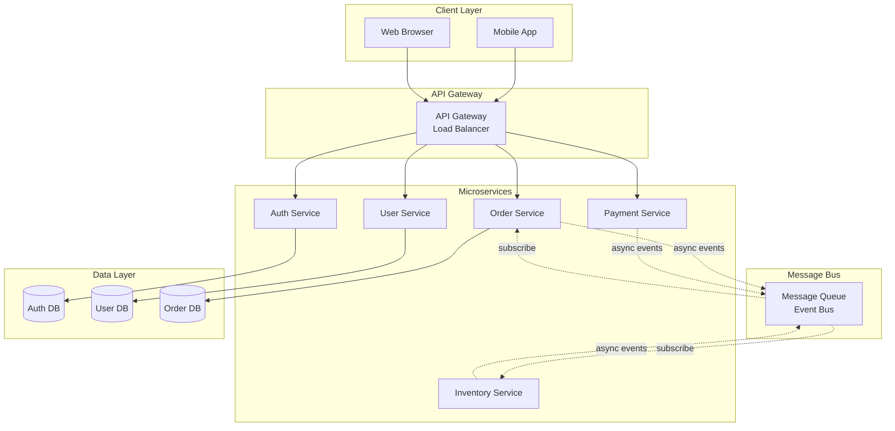
```

**Example 4: Java Memory Model**
```markdown
## Thread Memory Model

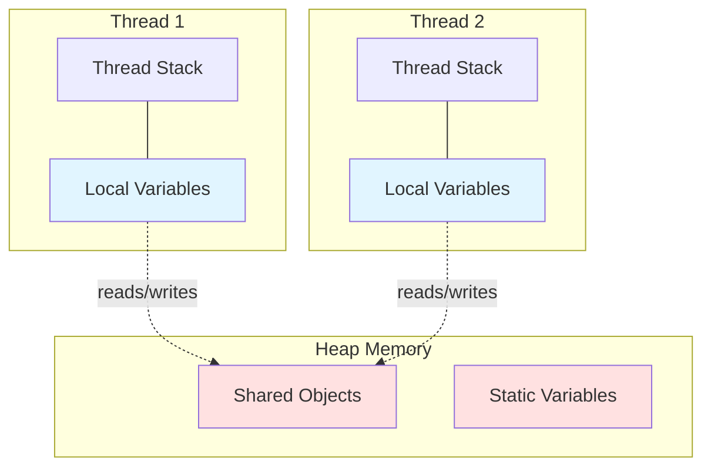
```

**Diagram Types to Implement:**
- **Sequence Diagrams**: OAuth flow, JWT authentication, distributed transactions
- **Flowcharts**: Stream operations, algorithm flows, decision trees
- **Architecture Diagrams**: Microservices, layered architecture, reactive systems
- **State Diagrams**: Thread lifecycle, transaction states
- **Entity Relationship**: Database schemas, class relationships
- **Gantt Charts**: Java version timeline, API evolution

**Migration Plan:**
1. Start with new content (concurrency, security topics)
2. Gradually replace static images in existing pages
3. Keep original images as fallback in comments
4. Create diagram library/snippets for common patterns

**Benefits:**
- Version controlled (no binary files)
- Easy to update and maintain
- Consistent styling across all diagrams
- Faster page loads (no image requests)
- Accessible (text-based, screen-reader friendly)
- No external dependencies

**Effort:** Medium (2-3 hours per diagram, ~60 hours for 32 existing images)

#### Concept Maps

**High-Level Topic Relationship Visualizations**

**Example: Design Patterns Ecosystem**
```markdown
## Design Patterns Concept Map

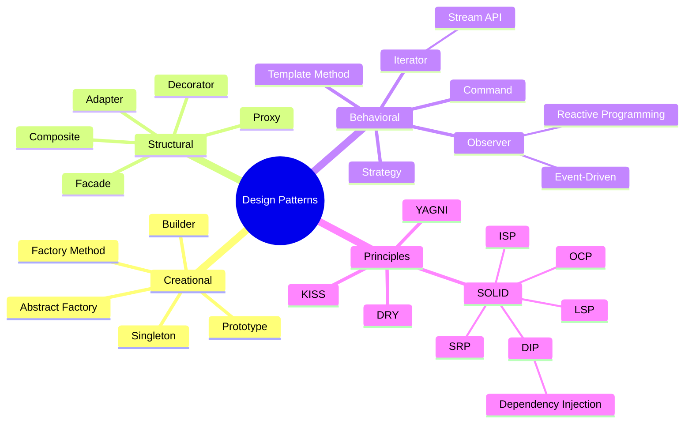
```

**Example: Java Evolution Map**
```markdown
## Java Version Features

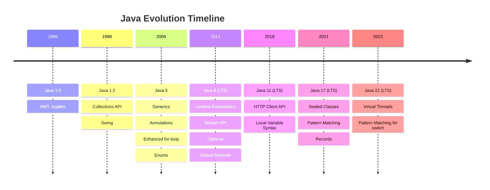
```

**Example: Database Concepts Hierarchy**
```markdown
## Database Theory Concepts

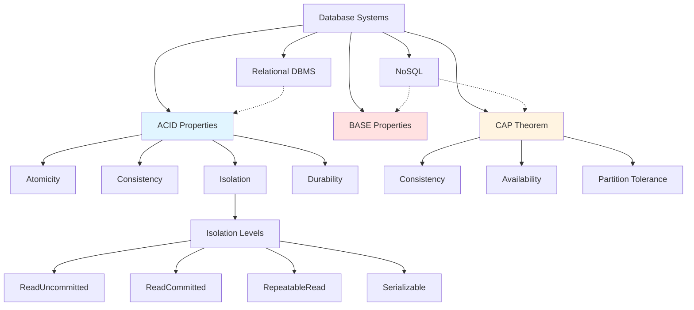
```

**Benefits:**
- Shows "big picture" connections
- Helps learners build mental models
- Complements detailed explanations
- Great for review/revision

**Effort:** Low-Medium (1-2 hours per concept map, 5-10 maps total)

#### Syntax Highlighting Themes

**Ensure Proper Language Tags**

Audit all code blocks to specify language for syntax highlighting:

**Before (no highlighting):**
````markdown
```
Stream<String> names = list.stream()
    .filter(s -> s.startsWith("A"))
    .collect(Collectors.toList());
```
````

**After (with Java highlighting):**
````markdown
```java
Stream<String> names = list.stream()
    .filter(s -> s.startsWith("A"))
    .collect(Collectors.toList());
```
````

**Supported Languages:**
- `java`, `javascript`, `python`, `json`, `yaml`
- `bash`, `sql`, `http`, `xml`, `html`, `css`
- `mermaid` for diagrams

**Implementation:**
- Audit all 60+ files for code blocks
- Add language tags where missing
- Standardize formatting (2-space vs 4-space indentation)

**Effort:** Low (automated script + manual review, 3-4 hours)

---

### 5. Real-World Context

#### "When to Use" Sections

**Practical Decision Guidance**

Add decision framework to architectural patterns and design choices:

```markdown
## When to Use Microservices

### ✅ Good Fit

**Large, Complex Applications**
- System has distinct business domains that can be independently developed
- Example: E-commerce platform (auth, catalog, cart, payment, shipping)

**Independent Team Scaling**
- Multiple teams working on different features
- Teams can deploy independently without coordination
- Example: Netflix (100+ engineering teams, 1000+ services)

**Technology Diversity**
- Different services have different technology requirements
- Example: Python for ML service, Go for high-performance API, Java for business logic

**Scalability Requirements**
- Different components need to scale differently
- Example: Read-heavy catalog vs write-heavy inventory

**Fault Isolation**
- Failures in one service shouldn't cascade to others
- Example: Recommendation engine down doesn't break checkout

### ❌ Poor Fit

**Simple CRUD Applications**
- Limited business logic
- Few domain boundaries
- Example: Basic blog, contact form, small internal tool

**Small Team (< 5 developers)**
- Operational overhead outweighs benefits
- Communication overhead increases
- Example: Startup MVP, side project

**Tight Coupling Between Domains**
- Frequent cross-service transactions
- Shared business logic
- Example: All operations require multiple service calls

**Limited DevOps Maturity**
- No CI/CD pipeline
- Manual deployment processes
- Limited monitoring/observability

**Performance-Critical Latency**
- Sub-millisecond response requirements
- Network overhead unacceptable
- Example: High-frequency trading system

### ⚠️ Consider Alternatives

- **Modular Monolith**: Start here, migrate to microservices if needed
- **Service-Oriented Architecture (SOA)**: Coarser-grained services
- **Serverless Functions**: Event-driven, auto-scaling without service management

### Decision Flowchart

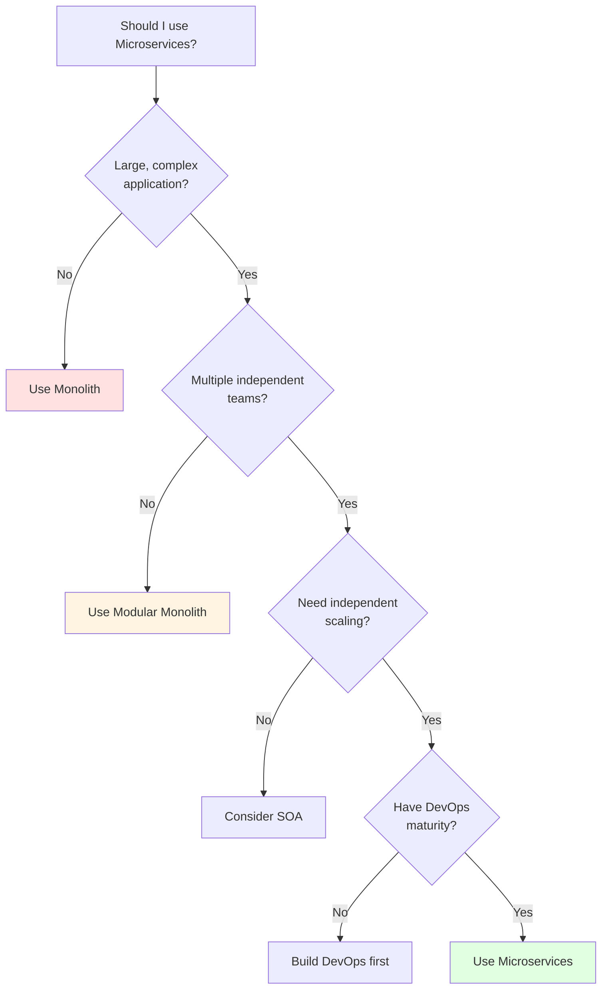
```

**Other Topics for "When to Use":**
- Stream API vs traditional loops
- SQL vs NoSQL databases
- OAuth vs JWT vs SAML
- Reactive programming vs traditional blocking I/O
- Different design patterns (Strategy vs Template Method vs State)

**Benefits:**
- Helps learners make practical decisions
- Prevents common mistakes
- Provides real-world context
- Builds decision-making skills

**Effort:** Medium (1-2 hours per topic, ~20 hours for key topics)

#### Industry Examples

**Real-World Usage Context**

Add "In Practice" sections showing how major companies use technologies:

```markdown
## In Practice: Reactive Programming

### Netflix
**Challenge:** Handle millions of concurrent streaming requests with high availability

**Solution:**
- Uses **RxJava** extensively in API Gateway (Zuul)
- Reactive patterns for asynchronous service-to-service communication
- Hystrix for circuit breaker pattern (reactive fault tolerance)

**Results:**
- Handles 1+ billion API requests per day
- 99.99% uptime
- Graceful degradation during failures

**Learn More:** [Netflix Tech Blog](https://netflixtechblog.com/)

---

### Uber
**Challenge:** Real-time location tracking and matching of millions of riders and drivers

**Solution:**
- Event-driven architecture with reactive streams
- Real-time data processing with Apache Flink (reactive stream processing)
- Observables for live location updates

**Results:**
- Sub-second matching times
- Handles 20+ million rides per day
- Real-time surge pricing updates

**Learn More:** [Uber Engineering Blog](https://eng.uber.com/)

---

### Spring Framework
**Challenge:** Build scalable, non-blocking web applications

**Solution:**
- **Spring WebFlux** - Reactive web framework built on Project Reactor
- Reactive database drivers (R2DBC)
- End-to-end reactive stack support

**Use Cases:**
- High-concurrency microservices
- Streaming data applications
- Server-Sent Events (SSE) for real-time updates

**Learn More:** [Spring WebFlux Docs](https://docs.spring.io/spring-framework/docs/current/reference/html/web-reactive.html)
```

**Other Industry Examples:**
- **Microservices**: Uber (2000+ services), Amazon, Spotify
- **CQRS + Event Sourcing**: Microsoft (Xbox Live), Axon Framework users
- **Stream API**: LinkedIn (Apache Kafka), Twitter analytics
- **NoSQL**: Facebook (Cassandra), Amazon (DynamoDB), Google (Bigtable)

**Benefits:**
- Validates learning with real-world proof
- Inspires learners with success stories
- Shows scale and complexity handling
- Provides additional learning resources

**Effort:** Low-Medium (30-45 minutes per industry example, ~10 hours total)

#### Common Pitfalls

**Anti-Patterns and Warnings**

Add "Common Mistakes" sections to prevent errors:

```markdown
## ⚠️ Common Mistakes with Streams

### 1. Modifying Source Collection During Stream Operation

**❌ Incorrect:**
```java
List<String> names = new ArrayList<>(Arrays.asList("Alice", "Bob", "Charlie"));
names.stream()
    .filter(name -> {
        names.remove(name); // ConcurrentModificationException!
        return name.startsWith("A");
    })
    .collect(Collectors.toList());
```

**✅ Correct:**
```java
List<String> names = new ArrayList<>(Arrays.asList("Alice", "Bob", "Charlie"));
List<String> filtered = names.stream()
    .filter(name -> name.startsWith("A"))
    .collect(Collectors.toList());
names.removeAll(names); // Modify after stream completes
names.addAll(filtered);
```

**Why:** Streams don't allow structural modification of the source during operation.

---

### 2. Reusing Streams

**❌ Incorrect:**
```java
Stream<String> stream = list.stream();
stream.forEach(System.out::println);
stream.forEach(System.out::println); // IllegalStateException!
```

**✅ Correct:**
```java
// Create new stream for each operation
list.stream().forEach(System.out::println);
list.stream().forEach(System.out::println);

// Or use Supplier for reusable stream creation
Supplier<Stream<String>> streamSupplier = () -> list.stream();
streamSupplier.get().forEach(System.out::println);
streamSupplier.get().forEach(System.out::println);
```

**Why:** Streams are single-use; after a terminal operation, they're consumed.

---

### 3. Using Parallel Streams for Small Collections

**❌ Inefficient:**
```java
List<Integer> small = Arrays.asList(1, 2, 3, 4, 5);
int sum = small.parallelStream() // Overhead > benefit
    .mapToInt(Integer::intValue)
    .sum();
```

**✅ Better:**
```java
int sum = small.stream() // Sequential is faster for small datasets
    .mapToInt(Integer::intValue)
    .sum();
```

**Why:** Parallel streams have overhead (thread pool, splitting, merging). Only beneficial for:
- Large datasets (typically 1000+ elements)
- Computationally expensive operations
- Independent, stateless operations

**Benchmark:** Sequential can be 2-10x faster for small collections!

---

### 4. Using Parallel Streams with I/O Operations

**❌ Dangerous:**
```java
files.parallelStream()
    .forEach(file -> {
        database.save(processFile(file)); // May exhaust connection pool!
        httpClient.post(data); // Blocking I/O in parallel!
    });
```

**✅ Better:**
```java
// Use bounded thread pool for I/O
ExecutorService executor = Executors.newFixedThreadPool(10);
files.stream()
    .forEach(file -> executor.submit(() -> {
        database.save(processFile(file));
    }));
executor.shutdown();

// Or use reactive libraries (Project Reactor, RxJava)
Flux.fromIterable(files)
    .flatMap(file -> processFileReactive(file), 10) // Concurrency limit
    .subscribe();
```

**Why:** Parallel streams use ForkJoinPool.commonPool() which is shared and unbounded for I/O.

---

### 5. Ignoring Stream Laziness

**❌ No Effect:**
```java
Stream<String> stream = list.stream()
    .filter(s -> s.length() > 5)
    .map(String::toUpperCase);
// Nothing happens yet! No terminal operation.
```

**✅ Triggers Execution:**
```java
List<String> result = list.stream()
    .filter(s -> s.length() > 5)
    .map(String::toUpperCase)
    .collect(Collectors.toList()); // Terminal operation executes pipeline
```

**Why:** Intermediate operations are lazy; only terminal operations trigger execution.

---

## 💡 Best Practices

1. **Prefer method references** over lambdas when possible:
   - `map(String::toUpperCase)` > `map(s -> s.toUpperCase())`

2. **Use appropriate collectors**:
   - `toList()`, `toSet()`, `toMap()` for collections
   - `joining()` for strings
   - `groupingBy()`, `partitioningBy()` for grouping

3. **Avoid stateful operations** in parallel streams:
   - Don't use `.forEach()` to accumulate in external variable
   - Use `.collect()` or `.reduce()` instead

4. **Choose sequential vs parallel** based on:
   - Dataset size (> 1000 elements for parallel)
   - Operation complexity (expensive operations benefit more)
   - Available cores (parallel needs multiple cores)

5. **Close resource streams**:
   ```java
   try (Stream<String> lines = Files.lines(path)) {
       lines.forEach(System.out::println);
   } // Auto-closed
   ```
```

**Other Topics for Common Pitfalls:**
- Microservices (distributed transactions, cascading failures)
- OAuth (implicit flow security issues, token storage)
- SQL (SQL injection, N+1 queries)
- Concurrency (deadlocks, race conditions, memory visibility)
- REST API (over-fetching, under-fetching, versioning mistakes)

**Benefits:**
- Prevents common errors
- Saves debugging time
- Builds best practices from the start
- Teaches defensive programming

**Effort:** Medium (2-3 hours per topic for comprehensive pitfalls, ~30 hours total)

---

### 6. Search & Discoverability

#### Tag System

**Front Matter Metadata**

Add YAML front matter to enable categorization and filtering:

```markdown
---
title: "Java Stream API"
tags: [java, java8, functional-programming, collections, streams]
category: programming
subcategory: java
difficulty: intermediate
prerequisites:
  - java-basics
  - collections-api
  - lambda-expressions
related_topics:
  - optional
  - collectors
  - parallel-streams
version_introduced: Java 8
estimated_reading_time: 15
last_updated: 2025-01-15
---

# Streams

[Content continues...]
```

**Benefits of Front Matter:**
- Enables advanced search and filtering
- Supports Jekyll metadata processing
- Can generate topic indexes automatically
- Facilitates content management

**Auto-Generated Tag Index** (`docs/tags/index.md`):
```markdown
# Topics by Tag

## Java
- [Stream API](../pages/programming/languages/java/java-8/stream-api.md) ![Intermediate]
- [Lambda Expressions](../pages/programming/languages/java/java-8/lambda-expression.md) ![Beginner]
- [Optional](../pages/programming/languages/java/java-8/optional.md) ![Intermediate]
- [Generics](../pages/programming/languages/java/java-5/generics.md) ![Intermediate]

## Functional Programming
- [Functional Programming Paradigm](../pages/programming/paradigms/functional.md) ![Intermediate]
- [Stream API](../pages/programming/languages/java/java-8/stream-api.md) ![Intermediate]
- [Lambda Expressions](../pages/programming/languages/java/java-8/lambda-expression.md) ![Beginner]

## Security
- [OAuth 2.0](../pages/ws-and-api-design/authn-and-authz/oauth.md) ![Intermediate]
- [JWT](../pages/ws-and-api-design/authn-and-authz/jwt.md) ![Beginner]
- [IAM](../pages/cyber-security/access-control-and-authn/iam.md) ![Beginner]
```

**Effort:** Medium (10 minutes per file to add front matter, ~10 hours + 3 hours for index generation)

#### Glossary Page

**Master Terminology Index**

Create comprehensive glossary with links:

```markdown
# Glossary

Quick reference for technical terms used throughout Data-Driven-Docs.

---

## A

**ACID** - Set of properties guaranteeing database transaction reliability: Atomicity, Consistency, Isolation, Durability. [Learn more →](pages/dbms/acid.md)

**API (Application Programming Interface)** - Set of protocols and tools for building software applications. [Learn more →](pages/ws-and-api-design/restful.md)

**AOP (Aspect-Oriented Programming)** - Programming paradigm that separates cross-cutting concerns (logging, security) from business logic.

**Authentication (AuthN)** - Process of verifying user identity. [Learn more →](pages/ws-and-api-design/authn-and-authz/authn-authz.md)

**Authorization (AuthZ)** - Process of verifying user permissions. [Learn more →](pages/ws-and-api-design/authn-and-authz/authn-authz.md)

---

## B

**BASE** - Alternative to ACID for distributed systems: Basically Available, Soft state, Eventually consistent. [Learn more →](pages/dbms/base.md)

**Backpressure** - Flow control mechanism in reactive streams to handle fast producers and slow consumers. [Learn more →](pages/programming/languages/java/java-8/project-reactor.md)

---

## C

**CAP Theorem** - Distributed systems can guarantee only 2 of 3: Consistency, Availability, Partition tolerance. [Learn more →](pages/dbms/cap.md)

**CQRS (Command Query Responsibility Segregation)** - Pattern separating read and write operations into different models.

**CI/CD (Continuous Integration/Continuous Deployment)** - DevOps practices for automated testing and deployment.

**CompletableFuture** - Java class for asynchronous, non-blocking programming. [Learn more →](pages/programming/languages/java/java-8/concurrency/completable-future.md) ⏳

---

## D

**Dependency Injection (DI)** - Design pattern providing object dependencies externally. [Learn more →](pages/design-patterns/solid.md#dependency-inversion)

**DRY (Don't Repeat Yourself)** - Software principle reducing code duplication.

---

## E

**Event Sourcing** - Pattern storing all state changes as sequence of events. [Learn more →](pages/architectural-patterns/event-sourcing.md) ⏳

**Executor** - Java framework for thread pool management. [Learn more →](pages/programming/languages/java/java-8/concurrency/executors.md) ⏳

---

## F

**Functional Interface** - Java interface with single abstract method, enabling lambda expressions. [Learn more →](pages/programming/languages/java/java-8/lambda-expression.md)

**Flux** - Project Reactor type representing 0-N asynchronous elements. [Learn more →](pages/programming/languages/java/java-8/project-reactor.md)

---

## H

**HATEOAS (Hypermedia As The Engine Of Application State)** - REST constraint for navigable APIs. [Learn more →](pages/ws-and-api-design/restful/restful-api-design.md#hateoas)

---

## I

**IAM (Identity and Access Management)** - Framework for managing digital identities and access rights. [Learn more →](pages/cyber-security/access-control-and-authn/iam.md)

**Isolation Level** - Degree to which concurrent database transactions are isolated from each other.

---

## J

**JWT (JSON Web Token)** - Compact, self-contained token format for secure information transmission. [Learn more →](pages/ws-and-api-design/authn-and-authz/jwt.md)

---

## L

**Lambda Expression** - Anonymous function enabling functional programming in Java. [Learn more →](pages/programming/languages/java/java-8/lambda-expression.md)

---

## M

**Microservices** - Architectural style structuring applications as collection of loosely coupled services. [Learn more →](pages/architectural-patterns/microservices.md)

**Mono** - Project Reactor type representing 0-1 asynchronous element. [Learn more →](pages/programming/languages/java/java-8/project-reactor.md)

**MVCC (Multi-Version Concurrency Control)** - Database concurrency control method using multiple versions of data.

---

## N

**NoSQL** - Non-relational database systems designed for scalability and flexibility. [Learn more →](pages/dbms/nosql.md)

---

## O

**OAuth** - Open standard for access delegation and authorization. [Learn more →](pages/ws-and-api-design/authn-and-authz/oauth.md)

**Observer Pattern** - Behavioral design pattern for event notification. [Learn more →](pages/design-patterns/behavioral/observer.md)

**OOP (Object-Oriented Programming)** - Programming paradigm based on objects and classes. [Learn more →](pages/programming/paradigms/object-oriented.md)

**Optional** - Java container object for handling potential null values. [Learn more →](pages/programming/languages/java/java-8/optional.md)

---

## R

**Reactive Programming** - Programming paradigm focused on asynchronous data streams and change propagation. [Learn more →](pages/programming/paradigms/reactive.md)

**REST (Representational State Transfer)** - Architectural style for designing networked applications. [Learn more →](pages/ws-and-api-design/restful.md)

---

## S

**SAML (Security Assertion Markup Language)** - XML-based standard for authentication and authorization. [Learn more →](pages/ws-and-api-design/authn-and-authz/saml.md)

**Saga Pattern** - Design pattern for managing distributed transactions. [Learn more →](pages/architectural-patterns/saga-pattern.md) ⏳

**SOLID** - Five design principles for maintainable object-oriented code. [Learn more →](pages/design-patterns/solid.md)

**Stream** - Java API for functional-style operations on collections. [Learn more →](pages/programming/languages/java/java-8/stream-api.md)

---

## T

**Two-Phase Commit (2PC)** - Distributed transaction protocol ensuring atomicity across multiple resources.

---

Legend:
- ✅ Complete content available
- ⏳ Planned/In progress

---

[Back to Home](index.md) | [Get Started](get-started.md)
```

**Benefits:**
- Quick terminology lookup
- SEO improvement (keyword rich)
- Helps beginners with acronyms
- Central reference point

**Effort:** Medium (10-15 hours for comprehensive glossary)

#### Search Optimization

**Keyword-Rich Summaries**

Add concise summaries at the top of each page:

```markdown
---
title: "Java Stream API"
summary: "Learn Java 8 Stream API for functional-style operations on collections, including intermediate operations (map, filter, flatMap), terminal operations (collect, reduce, forEach), and parallel processing for performance optimization."
keywords: [java stream, stream api, functional programming, lambda, collectors, parallel streams, java 8]
---

# Streams

> **📖 Quick Summary:** This page covers Java 8 Stream API for functional-style operations on collections. You'll learn about intermediate operations (map, filter), terminal operations (collect, reduce), lazy evaluation, parallel processing, and best practices for efficient data processing.

[Table of Contents...]
```

**SEO Benefits:**
- Better GitHub search results
- Improved Google discoverability
- Clear expectations before reading
- Social media link previews

**Effort:** Low (15 minutes per page, ~15 hours total)

---

### 7. Community & Contribution Features

#### Contribution Templates

**Standardized Issue/PR Templates**

Create `.github/ISSUE_TEMPLATE/new-topic-proposal.md`:

```markdown
---
name: New Topic Proposal
about: Suggest a new topic for the documentation
title: '[NEW TOPIC] '
labels: enhancement, content
assignees: ''
---

## Topic Information

**Topic Name:** (e.g., "GraphQL API Design")

**Category:** (e.g., Web Services & API Design)

**Difficulty Level:**
- [ ] Beginner
- [ ] Intermediate
- [ ] Advanced

**Estimated Reading Time:** (in minutes)

---

## Topic Overview

**Brief Description:**
<!-- 2-3 sentences describing what this topic will cover -->

**Why This Topic Matters:**
<!-- Explain relevance and use cases -->

---

## Proposed Content Outline

1. Introduction
2. Key Concepts
3. Examples
4. Best Practices
5. Common Pitfalls
6. References

---

## Prerequisites

**Learners should know:**
- [ ] Topic 1
- [ ] Topic 2

**Related Topics:**
- Topic A (link if exists)
- Topic B (link if exists)

---

## Resources

**Official Documentation:**
- Link 1
- Link 2

**Tutorials/Articles:**
- Link 1
- Link 2

---

## Contribution Checklist

- [ ] Topic follows [template structure](../docs/pages/common/template.md)
- [ ] Includes code examples
- [ ] Has diagrams/visuals (if applicable)
- [ ] Contains external references
- [ ] Will be linked from [get-started.md](../docs/get-started.md)
- [ ] No orphaned content (all links valid)
- [ ] Front matter metadata included

---

## Additional Notes

<!-- Any other information that might be helpful -->
```

Create `.github/PULL_REQUEST_TEMPLATE.md`:

```markdown
## Pull Request: Content Contribution

### Type of Change
- [ ] New topic/page
- [ ] Content enhancement (existing page)
- [ ] Bug fix (broken link, typo, error)
- [ ] Visual improvement (diagram, example)
- [ ] Navigation/structure improvement

---

### Topic Information

**Page(s) Modified/Added:**
- `docs/pages/...`

**Category:**
- [ ] Programming
- [ ] DBMS
- [ ] Web Services & API Design
- [ ] Design Patterns
- [ ] Architectural Patterns
- [ ] Cyber-security
- [ ] Other: ___________

---

### Content Checklist

#### Structure
- [ ] Follows [template structure](docs/pages/common/template.md)
- [ ] Has Table of Contents
- [ ] Includes "Back to top" links
- [ ] Has navigation footer
- [ ] Front matter metadata added (if applicable)

#### Content Quality
- [ ] Code examples are tested and working
- [ ] Language tags on all code blocks (e.g., ```java)
- [ ] External references included
- [ ] No broken links (tested with MarkdownFileReferences.java)
- [ ] Images have alt text
- [ ] Diagrams use Mermaid.js (preferred) or optimized images

#### Integration
- [ ] Linked from `get-started.md`
- [ ] Related topics cross-referenced
- [ ] Added to relevant learning path (if applicable)
- [ ] No orphaned content

#### Writing Style
- [ ] Concise explanations (breadth over depth)
- [ ] Clear headings and sections
- [ ] Real-world examples included
- [ ] Common pitfalls addressed (if applicable)

---

### Testing

**Markdown Validation:**
```bash
# Did you run the reference checker?
java -jar code/MarkdownFileReferences.java
```

**Local Preview:**
- [ ] Previewed with Jekyll locally
- [ ] All links work
- [ ] Images display correctly
- [ ] Code syntax highlighting works

---

### Screenshots (if applicable)

<!-- Add screenshots showing new content, diagrams, or improvements -->

---

### Related Issues

Closes #___
Related to #___

---

### Additional Notes

<!-- Any context or decisions made during development -->
```

**Benefits:**
- Standardizes contributions
- Ensures quality control
- Reduces review time
- Educates contributors

**Effort:** Low (2-3 hours to create templates)

#### "Last Reviewed" Dates

**Content Freshness Tracking**

Add review metadata to detect stale content:

```markdown
---
title: "Java Stream API"
created: 2024-03-15
last_reviewed: 2025-01-20
review_frequency: quarterly
needs_update: false
update_notes: ""
---

# Streams

> **ℹ️ Content Status:** Last reviewed January 2025. Core concepts remain current for Java 8-21.

[Content continues...]

---

**Planned Updates:**
- [ ] Add Java 21 virtual thread examples (Q2 2025)
- [ ] Benchmark updates for latest JVM (Q3 2025)
```

**Stale Content Report (auto-generated):**
```markdown
## 📅 Content Review Status

### Needs Review (> 6 months)
- [ ] `programming/languages/java/java-7/` - Last reviewed: 2024-05-10
- [ ] `dbms/distributed-transactions.md` - Last reviewed: 2024-06-15

### Recently Updated ✅
- `java-8/stream-api.md` - Reviewed: 2025-01-20
- `ws-and-api-design/oauth.md` - Reviewed: 2025-01-18
- `design-patterns/solid.md` - Reviewed: 2025-01-15

### Review Schedule
- Monthly: Security topics, API design
- Quarterly: Programming languages, frameworks
- Annually: Fundamental concepts (ACID, design patterns)
```

**Benefits:**
- Maintains content quality
- Identifies outdated information
- Schedules regular updates
- Builds user trust

**Effort:** Low (5 minutes per page + automation script, ~8 hours)

#### Feedback Mechanism

**User Engagement & Improvement**

Add feedback prompts:

```markdown
---

## Was This Helpful?

Your feedback helps improve this guide for everyone!

**Found an error?** [Report it](https://github.com/ggranados/data-driven-docs/issues/new?title=Error:%20Stream%20API&labels=bug)

**Have a suggestion?** [Share your idea](https://github.com/ggranados/data-driven-docs/issues/new?title=Suggestion:%20Stream%20API&labels=enhancement)

**Want to contribute?** [See contribution guidelines](../../CONTRIBUTING.md)

---

**Quick Feedback:**

Did this page answer your question?
- 👍 [Yes](https://github.com/ggranados/data-driven-docs/issues/new?title=Feedback:Helpful:Stream%20API)
- 👎 [No](https://github.com/ggranados/data-driven-docs/issues/new?title=Feedback:Not%20Helpful:Stream%20API)

What would make this page better? (open issue with your thoughts)

---
```

**Analytics Integration (optional):**
```html
<!-- Add to pages for usage tracking -->
<script>
// Track page views, time on page, scroll depth
// Privacy-friendly analytics (Plausible, Fathom)
</script>
```

**Benefits:**
- Direct user input
- Identifies pain points
- Prioritizes improvements
- Builds community

**Effort:** Low (template addition, 5 hours)

---

### 8. Cross-Reference Improvements

#### Automated Link Validation

**Enhanced MarkdownFileReferences.java**

Extend existing tool with new features:

```java
package edu.datadrivendocs.code.utils;

import java.io.*;
import java.nio.file.*;
import java.util.*;
import java.util.logging.Logger;
import java.util.regex.*;

public class EnhancedMarkdownValidator {

    private static final Logger log = Logger.getLogger(EnhancedMarkdownValidator.class.getName());

    public static void main(String[] args) throws IOException {
        String docsPath = "docs";

        // Existing functionality
        validateFileReferences(docsPath);

        // NEW: Find broken internal links
        findBrokenLinks(docsPath);

        // NEW: Find orphaned images
        findOrphanedImages(docsPath);

        // NEW: Generate cross-reference graph
        generateCrossReferenceGraph(docsPath);

        // NEW: Suggest related topics
        suggestRelatedTopics(docsPath);

        // NEW: Validate front matter
        validateFrontMatter(docsPath);
    }

    private static void findBrokenLinks(String path) throws IOException {
        log.info("Checking for broken internal links...");
        // Implementation: Parse markdown links, verify target files exist
        // Report: List of broken links with source file and line number
    }

    private static void findOrphanedImages(String path) throws IOException {
        log.info("Finding orphaned images...");
        // Implementation: List all images, check if referenced in any .md file
        // Report: Unused images that can be deleted
    }

    private static void generateCrossReferenceGraph(String path) throws IOException {
        log.info("Generating cross-reference graph...");
        // Implementation: Build directed graph of page relationships
        // Output: Mermaid.js graph or DOT format for visualization
    }

    private static void suggestRelatedTopics(String path) throws IOException {
        log.info("Analyzing topics for suggestions...");
        // Implementation: Keyword analysis, find pages with similar terms
        // Output: Suggested "Related Topics" for each page
    }

    private static void validateFrontMatter(String path) throws IOException {
        log.info("Validating front matter metadata...");
        // Implementation: Check for required fields, validate values
        // Report: Pages missing metadata, invalid values
    }
}
```

**Output Example:**
```
=== MARKDOWN VALIDATION REPORT ===

[1] Broken Internal Links (5 found)
❌ docs/pages/java-8/stream-api.md:45
   Link: [Collections API](../java-5/collections.md)
   Error: File not found (should be: enhanced-collections.md)

❌ docs/pages/microservices.md:112
   Link: [Event Sourcing](event-sourcing.md)
   Error: File exists but is empty (TODO placeholder)

[2] Orphaned Images (3 found)
🖼️ docs/img/old-diagram.png - Not referenced in any markdown file
🖼️ docs/img/temp-screenshot.jpg - Not referenced in any markdown file

[3] Missing Front Matter (8 pages)
⚠️ docs/pages/dbms/acid.md - Missing: tags, difficulty, estimated_reading_time
⚠️ docs/pages/design-patterns/solid.md - Missing: prerequisites

[4] Cross-Reference Suggestions
💡 docs/pages/java-8/stream-api.md
   Suggested related topics:
   - Optional (33% keyword overlap)
   - Functional Programming (28% keyword overlap)
   - Lambda Expressions (already linked ✓)

=== SUMMARY ===
✅ Total pages: 58
❌ Issues found: 16
🔧 Action required: 5 broken links, 3 orphaned images, 8 incomplete metadata
```

**Benefits:**
- Prevents broken links
- Cleans up unused resources
- Suggests content connections
- Automates quality checks

**Effort:** Medium (10-15 hours for full implementation)

#### Breadcrumb Navigation

**Hierarchical Context**

Add breadcrumb trail to all pages:

```markdown
<nav aria-label="breadcrumb">
  <ol class="breadcrumb">
    <li><a href="../../index.md">🏠 Home</a></li>
    <li><a href="../programming.md">Programming</a></li>
    <li><a href="java.md">Java</a></li>
    <li><a href="java-8.md">Java 8</a></li>
    <li class="active">Stream API</li>
  </ol>
</nav>

# Streams
...
```

**Visual Rendering:**
```
🏠 Home > Programming > Java > Java 8 > Stream API
```

**Implementation:**
- Can be auto-generated from file path
- Include in template.md
- Add CSS styling for GitHub Pages theme

**Benefits:**
- Shows current location in hierarchy
- Enables quick navigation to parent topics
- Improves UX on deep pages
- Reduces cognitive load

**Effort:** Low-Medium (template update + script to add to all pages, 6-8 hours)

#### Topic Clustering

**Visual Relationship Indicators**

Group related topics with cluster badges:

```markdown
---
clusters:
  - reactive-ecosystem
  - java8-features
  - functional-programming
---

# Stream API

<div class="topic-clusters">
  <span class="cluster-badge">🔗 Part of: Reactive Ecosystem</span>
  <span class="cluster-badge">🔗 Part of: Java 8 Features</span>
  <span class="cluster-badge">🔗 Part of: Functional Programming</span>
</div>

---

## Related in "Reactive Ecosystem" Cluster

This topic is part of a larger ecosystem of reactive programming concepts:

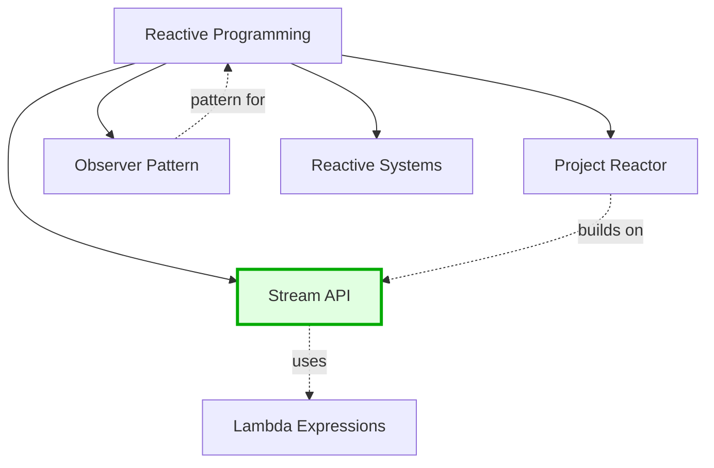

**Related Topics in This Cluster:**
- [Lambda Expressions](lambda-expression.md) - Foundation for streams
- [Project Reactor](project-reactor.md) - Advanced reactive streams
- [Observer Pattern](../../design-patterns/behavioral/observer.md) - Event notification design
- [Reactive Systems](../../architectural-patterns/reactive.md) - Architecture principles
- [Functional Programming](../../paradigms/functional.md) - Programming paradigm

---
```

**Predefined Clusters:**
- **reactive-ecosystem**: Stream API, Project Reactor, Observer Pattern, Reactive Systems
- **java8-features**: Lambda, Stream, Optional, Method References, Functional Interfaces
- **api-security**: OAuth, JWT, SAML, OpenID Connect, IAM
- **database-theory**: ACID, BASE, CAP, Isolation Levels, Transactions
- **microservices-patterns**: Microservices, Saga, Event Sourcing, CQRS, Message-Driven

**Benefits:**
- Shows "big picture" connections
- Encourages holistic learning
- Improves topic discovery
- Creates learning narratives

**Effort:** Medium (cluster definition + adding to pages, 12-15 hours)

---

### 9. Mobile & Accessibility

#### Responsive Tables

**Mobile-Friendly Data Display**

Convert wide tables to responsive format:

**Before (breaks on mobile):**
```markdown
| Feature | SQL (RDBMS) | MongoDB | Cassandra | Redis | Neo4j |
|---------|-------------|---------|-----------|-------|-------|
| Data Model | Relational Tables | Document | Wide Column | Key-Value | Graph |
| Schema | Fixed Schema | Flexible Schema | Schema-free | Schema-free | Property Graph |
...
```

**After (mobile responsive):**
```markdown
<div class="table-wrapper" markdown="block">

| Feature | SQL (RDBMS) | MongoDB | Cassandra | Redis | Neo4j |
|---------|-------------|---------|-----------|-------|-------|
| Data Model | Relational Tables | Document | Wide Column | Key-Value | Graph |
| Schema | Fixed Schema | Flexible Schema | Schema-free | Schema-free | Property Graph |
| Query Language | SQL | MQL | CQL | Commands | Cypher |
| ACID | Full ACID | Multi-document ACID | Eventual Consistency | No transactions | ACID |
| Scalability | Vertical | Horizontal | Horizontal | Horizontal | Vertical/Horizontal |
| Best For | Complex queries, joins | Flexible data | High write throughput | Caching, sessions | Relationships, graphs |

</div>

<style>
.table-wrapper {
  overflow-x: auto;
  -webkit-overflow-scrolling: touch;
}
</style>
```

**Alternative: Comparison Cards (for mobile):**
```markdown
## Database Comparison

<div class="comparison-grid">

### SQL (RDBMS)
**Data Model:** Relational Tables
**Schema:** Fixed
**Query:** SQL
**ACID:** Full ACID
**Scaling:** Vertical
**Best For:** Complex queries, joins

### MongoDB
**Data Model:** Document
**Schema:** Flexible
**Query:** MQL
**ACID:** Multi-document
**Scaling:** Horizontal
**Best For:** Flexible data

### Cassandra
**Data Model:** Wide Column
**Schema:** Schema-free
**Query:** CQL
**ACID:** Eventual Consistency
**Scaling:** Horizontal
**Best For:** High write throughput

</div>
```

**Benefits:**
- Better mobile experience
- Accessible on all devices
- No horizontal scrolling
- Improved readability

**Effort:** Low (CSS + converting existing tables, 4-6 hours)

#### Alt Text for Diagrams

**Accessibility Compliance**

Ensure all images have descriptive alt text:

**Before:**
```markdown

```

**After:**
```markdown

```

**Alt Text Guidelines:**
- Describe the diagram's purpose and key information
- Mention important entities and relationships
- Describe the flow/sequence
- Keep concise but informative (1-2 sentences)
- Don't start with "Image of" or "Diagram of"

**For Mermaid Diagrams:**
```markdown
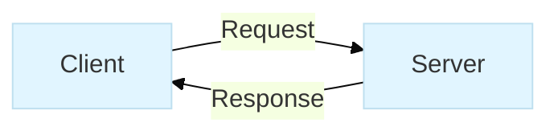

<details>
<summary>Diagram Description (for screen readers)</summary>
This flowchart shows a simple client-server interaction where the client sends a request to the server, and the server returns a response.
</details>
```

**Benefits:**
- Screen reader compatible
- Improves SEO
- Better accessibility compliance
- Helps users with slow connections

**Effort:** Low (15 minutes per image, ~8 hours for 32 images)

#### Reading Time Estimates

**User Expectation Management**

Add estimated reading time to longer documents:

```markdown
---
title: "Java Stream API"
estimated_reading_time: 15
word_count: 3200
---

# Streams

**📖 Reading time:** ~15 minutes
**💻 Hands-on examples:** 12
**🎯 Difficulty:** Intermediate

> **Quick Summary:** Learn functional-style collection operations with Java Streams...

[Table of Contents...]
```

**Calculation Formula:**
```
Reading Time = (Word Count / 200 words per minute) + (Code Examples × 1 minute)
```

**Add to Template:**
```markdown
**📖 Reading time:** ~X minutes
**💻 Examples:** Y
**🎯 Difficulty:** [Beginner/Intermediate/Advanced]
```

**Benefits:**
- Helps users plan learning time
- Sets expectations
- Improves time management
- Professional appearance

**Effort:** Low (automated script + manual review, 4-6 hours)

---

### 10. Version-Specific Content

#### Technology Version Badges

**Clear Version Requirements**

Add version badges to indicate feature availability:

```markdown
# Virtual Threads  

# Records  

# Lambda Expressions  

# Sealed Classes  
```

**Version Matrix Table:**
```markdown
## Stream API Feature Availability

| Feature | Java 8 | Java 9 | Java 10 | Java 11+ |
|---------|:------:|:------:|:-------:|:--------:|
| Basic Streams | ✅ | ✅ | ✅ | ✅ |
| `takeWhile()` / `dropWhile()` | ❌ | ✅ | ✅ | ✅ |
| `ofNullable()` | ❌ | ✅ | ✅ | ✅ |
| `iterate()` with predicate | ❌ | ✅ | ✅ | ✅ |
| Local-variable type inference (`var`) | ❌ | ❌ | ✅ | ✅ |
| `toList()` (unmodifiable) | ❌ | ❌ | ❌ | ✅ (Java 16+) |

**Legend:**
- ✅ Available
- ❌ Not available
- 🔶 Preview feature
```

**Benefits:**
- Prevents version confusion
- Helps with upgrade planning
- Shows feature evolution
- Professional documentation

**Effort:** Low (badge generation + version research, 6-8 hours)

#### Compatibility Notes

**Migration and Alternative Guidance**

Add version compatibility notes:

```markdown
## CompletableFuture 

> **Version Note:** This feature requires Java 8 or higher.
>
> **For Java 7 and earlier:** Use `Future` with `ExecutorService` ([see alternative approach](#java-7-alternative))

### Modern Approach (Java 8+)

```java
CompletableFuture<String> future = CompletableFuture.supplyAsync(() -> {
    return "Hello from async task";
});

future.thenAccept(result -> System.out.println(result));
```

### Java 7 Alternative

<details>
<summary>Click to see Java 7 compatible code</summary>

```java
ExecutorService executor = Executors.newSingleThreadExecutor();
Future<String> future = executor.submit(new Callable<String>() {
    @Override
    public String call() throws Exception {
        return "Hello from async task";
    }
});

try {
    String result = future.get();
    System.out.println(result);
} catch (InterruptedException | ExecutionException e) {
    e.printStackTrace();
} finally {
    executor.shutdown();
}
```

**Limitations:**
- More verbose (no lambda syntax)
- No chaining (`thenApply`, `thenCompose`)
- Manual exception handling
- Must manage executor lifecycle

**Migration Guide:** [Upgrading to CompletableFuture](migration-guide.md)

</details>

---

## Compatibility Matrix

| Feature | Java 8 | Java 11 | Java 17 | Java 21 |
|---------|:------:|:-------:|:-------:|:-------:|
| `supplyAsync()` | ✅ | ✅ | ✅ | ✅ |
| `orTimeout()` | ❌ | ✅ | ✅ | ✅ |
| `completeOnTimeout()` | ❌ | ✅ | ✅ | ✅ |
| Virtual thread support | ❌ | ❌ | ❌ | ✅ |
```

**Benefits:**
- Supports legacy systems
- Smooth upgrade path
- Shows evolution over time
- Reduces frustration

**Effort:** Medium (research + code examples for alternatives, 15-20 hours)

---

### 11. Performance & Technical Improvements

#### Image Optimization

**Faster Page Loads**

Optimize all diagrams and images:

**Current State:**
- 32 PNG/JPG diagrams
- Sizes range from 50KB to 500KB
- No lazy loading

**Optimization Strategy:**

1. **Convert to SVG where possible**
   - Technical diagrams, flowcharts, architecture diagrams
   - Infinite scalability, smaller file size
   - Text remains selectable

2. **Use Mermaid.js for new diagrams**
   - No image files needed
   - Rendered client-side
   - Version controlled as code

3. **Compress raster images**
   - PNG: Use `pngquant` or `tinypng.com`
   - JPG: Use `jpegoptim` or `squoosh.app`
   - Target: < 100KB per image

4. **Implement WebP with PNG fallback**
   ```markdown
   <picture>
     <source srcset="../../img/oauth-flow.webp" type="image/webp">
     
   </picture>
   ```

5. **Add lazy loading**
   ```markdown
   {:loading="lazy"}
   ```

**Expected Results:**
- 50-70% reduction in image sizes
- Faster page load times
- Better mobile experience
- Reduced bandwidth usage

**Effort:** Medium (image conversion + optimization, 8-10 hours)

#### Static Search Implementation

**Client-Side Search with Lunr.js**

Add search functionality without backend:

**Jekyll Plugin Configuration** (`docs/_config.yml`):
```yaml
plugins:
  - jekyll-lunr-js-search

lunr_search:
  excludes: [index.md]
  min_length: 3
  stopwords: 'stopwords.txt'
```

**Search Interface** (add to `docs/index.md`):
```markdown
## 🔍 Search Documentation

<div id="search-container">
  <input type="text" id="search-input" placeholder="Search topics..." aria-label="Search">
  <ul id="results-container"></ul>
</div>

<script src="https://unpkg.com/lunr/lunr.js"></script>
<script src="assets/js/search.js"></script>
```

**Search Script** (`docs/assets/js/search.js`):
```javascript
// Initialize Lunr index
const idx = lunr(function () {
  this.field('title', { boost: 10 });
  this.field('tags', { boost: 5 });
  this.field('content');
  this.ref('url');

  documents.forEach(doc => this.add(doc));
});

// Search handler
document.getElementById('search-input').addEventListener('keyup', function(e) {
  const query = e.target.value;
  if (query.length < 3) return;

  const results = idx.search(query);
  displayResults(results);
});
```

**Alternative: Algolia**
```yaml
# _config.yml
algolia:
  application_id: YOUR_APP_ID
  index_name: data-driven-docs
  search_only_api_key: YOUR_SEARCH_KEY
```

**Benefits:**
- Fast, client-side search
- No server required
- Works offline (PWA)
- Better than browser Ctrl+F

**Effort:** Medium (8-12 hours for implementation + testing)

#### Dark Mode Support

**Theme Toggle for Better Readability**

Implement dark mode with preference persistence:

**CSS Variables** (`docs/assets/css/dark-mode.css`):
```css
:root {
  --bg-color: #ffffff;
  --text-color: #333333;
  --code-bg: #f5f5f5;
  --link-color: #0066cc;
  --border-color: #dddddd;
}

[data-theme="dark"] {
  --bg-color: #1a1a1a;
  --text-color: #e0e0e0;
  --code-bg: #2d2d2d;
  --link-color: #66b3ff;
  --border-color: #444444;
}

body {
  background-color: var(--bg-color);
  color: var(--text-color);
}

code {
  background-color: var(--code-bg);
}

a {
  color: var(--link-color);
}

/* Respect system preference */
@media (prefers-color-scheme: dark) {
  :root {
    --bg-color: #1a1a1a;
    --text-color: #e0e0e0;
    --code-bg: #2d2d2d;
    --link-color: #66b3ff;
  }
}
```

**Toggle Button** (add to header):
```html
<button id="theme-toggle" aria-label="Toggle dark mode">
  <span class="sun-icon">☀️</span>
  <span class="moon-icon">🌙</span>
</button>

<script>
  const toggle = document.getElementById('theme-toggle');
  const currentTheme = localStorage.getItem('theme') ||
    (window.matchMedia('(prefers-color-scheme: dark)').matches ? 'dark' : 'light');

  document.documentElement.setAttribute('data-theme', currentTheme);

  toggle.addEventListener('click', () => {
    const theme = document.documentElement.getAttribute('data-theme') === 'dark' ? 'light' : 'dark';
    document.documentElement.setAttribute('data-theme', theme);
    localStorage.setItem('theme', theme);
  });
</script>
```

**Benefits:**
- Reduces eye strain
- Better for night reading
- Modern UX expectation
- Respects system preferences

**Effort:** Low-Medium (6-8 hours for implementation + testing)

---

### 12. Analytics & Insights

#### Popular Topics Indicator

**Data-Driven Content Priorities**

Show trending topics based on views/engagement:

```markdown
## 🔥 Trending Topics This Month

1. **[Java Stream API](pages/programming/languages/java/java-8/stream-api.md)** - 2,341 views
   *Most searched: parallel streams, collectors, flatMap*

2. **[Microservices Architecture](pages/architectural-patterns/microservices.md)** - 1,892 views
   *Most searched: distributed transactions, service discovery*

3. **[OAuth 2.0](pages/ws-and-api-design/authn-and-authz/oauth.md)** - 1,654 views
   *Most searched: authorization code flow, refresh tokens*

4. **[SOLID Principles](pages/design-patterns/solid.md)** - 1,432 views
   *Most searched: dependency inversion, interface segregation*

5. **[RESTful API Design](pages/ws-and-api-design/restful/restful-api-design.md)** - 1,287 views
   *Most searched: HATEOAS, versioning, pagination*

---

## 📈 Fastest Growing Topics

- **CompletableFuture** +245% (newly added content)
- **Event Sourcing** +189% (architectural pattern interest)
- **NoSQL Databases** +156% (MongoDB tutorials)
```

**Implementation:**
- Privacy-friendly analytics (Plausible, Fathom)
- GitHub traffic API for page views
- Update monthly via GitHub Actions

**Benefits:**
- Shows popular content
- Guides content priorities
- Validates effort
- Helps users find trending topics

**Effort:** Medium (analytics integration + automation, 10-12 hours)

#### Content Heatmap

**Visual Coverage Dashboard**

Create visual representation of topic maturity:

```markdown
## 📊 Documentation Coverage

### Overall Progress: 68% ████████████░░░░░░░░

---

### By Category

**Programming** (75%) ███████████████░░░░░
- ✅ Java 8+ Features: 95% ███████████████████░
- ✅ Paradigms: 85% █████████████████░░░
- 🔄 Other Languages: 20% ████░░░░░░░░░░░░░░░░

**Database Management** (82%) ████████████████░░░░
- ✅ Concepts: 100% ████████████████████
- ✅ SQL: 90% ██████████████████░░
- ✅ NoSQL: 80% ████████████████░░░░

**Web Services & API Design** (78%) ████████████████░░░░
- ✅ RESTful: 85% █████████████████░░░
- ✅ Authentication: 100% ████████████████████
- 🔄 API Tooling: 45% █████████░░░░░░░░░░░

**Design Patterns** (42%) ████████░░░░░░░░░░░░
- ✅ SOLID: 100% ████████████████████
- 🔄 GoF Patterns: 15% ███░░░░░░░░░░░░░░░░░
- ✅ DI/IoC: 80% ████████████████░░░░

**Architectural Patterns** (65%) █████████████░░░░░░░
- ✅ Microservices: 80% ████████████████░░░░
- ✅ Reactive: 90% ██████████████████░░
- 🔄 Event-Driven: 30% ██████░░░░░░░░░░░░░░

**Cyber-security** (25%) █████░░░░░░░░░░░░░░░
- ✅ IAM: 80% ████████████████░░░░
- ⏳ OWASP: 10% ██░░░░░░░░░░░░░░░░░░
- ⏳ Web Security: 5% █░░░░░░░░░░░░░░░░░░░

---

### Legend
- ✅ Well-developed (> 70%)
- 🔄 In progress (30-70%)
- ⏳ Planned (< 30%)

### Priority Gaps
1. **Cyber-security** - Only 25% complete, high demand
2. **Design Patterns** - Missing 85% of GoF patterns
3. **Event-Driven Architecture** - Referenced but incomplete
```

**Visual Dashboard (Mermaid):**
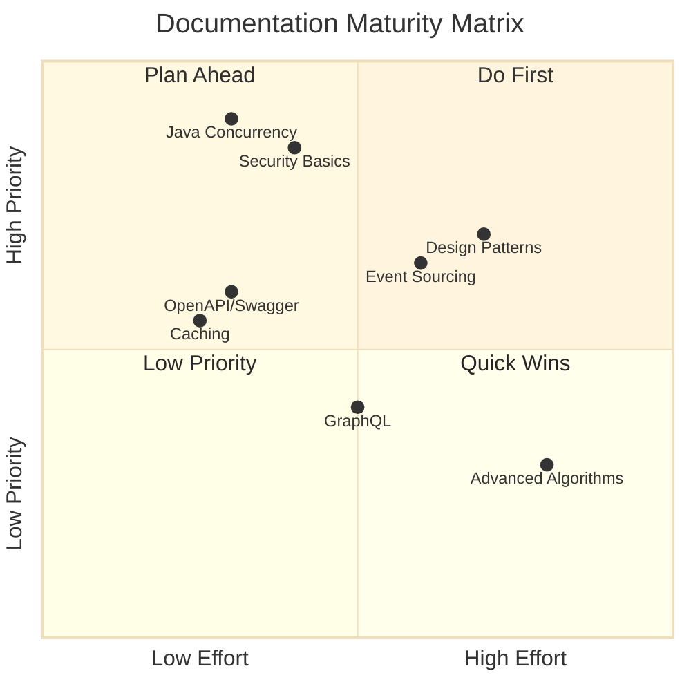

**Benefits:**
- Quick status overview
- Identifies priorities
- Motivates contribution
- Tracks progress over time

**Effort:** Medium (initial setup + automation, 8-10 hours)

---

## Implementation Priority Matrix

### Quick Wins (Low effort, High impact)

**Estimated Total Time: 30-40 hours**

| # | Enhancement | Effort | Impact | Priority |
|---|-------------|--------|--------|----------|
| 1 | Add "Related Topics" sections to existing pages | 20-30h | High | ⭐⭐⭐ |
| 2 | Create learning paths in get-started.md | 3-4h | High | ⭐⭐⭐ |
| 3 | Add "When to Use" sections to patterns | 15-20h | High | ⭐⭐⭐ |
| 4 | Add knowledge check questions | 10-15h | Medium | ⭐⭐ |
| 5 | Add difficulty badges to all pages | 8-10h | Medium | ⭐⭐ |
| 6 | Add reading time estimates | 4-6h | Low | ⭐ |
| 7 | Add feedback prompts | 5h | Medium | ⭐⭐ |
| 8 | Improve alt text for images | 8h | Medium | ⭐⭐ |

**Total Quick Wins: 73-98 hours**

---

### High Priority (Medium effort, High impact)

**Estimated Total Time: 100-150 hours**

| # | Enhancement | Effort | Impact | Priority |
|---|-------------|--------|--------|----------|
| 1 | **Complete Java concurrency section** | 20-30h | Critical | ⭐⭐⭐ |
| 2 | **Add OpenAPI/Swagger documentation** | 3-4h | High | ⭐⭐⭐ |
| 3 | **Create security essentials pages** | 8-12h | Critical | ⭐⭐⭐ |
| 4 | Convert diagrams to Mermaid.js | 30-40h | High | ⭐⭐⭐ |
| 5 | Implement search functionality | 8-12h | High | ⭐⭐⭐ |
| 6 | Add "Common Pitfalls" sections | 20-30h | High | ⭐⭐⭐ |
| 7 | Complete microservices patterns | 12-16h | High | ⭐⭐ |
| 8 | Create comprehensive glossary | 10-15h | Medium | ⭐⭐ |
| 9 | Enhanced MarkdownValidator tool | 10-15h | Medium | ⭐⭐ |
| 10 | Add breadcrumb navigation | 6-8h | Medium | ⭐⭐ |

**Total High Priority: 127-182 hours**

---

### Long Term (High effort, High impact)

**Estimated Total Time: 80-120 hours**

| # | Enhancement | Effort | Impact | Priority |
|---|-------------|--------|--------|----------|
| 1 | Build interactive code playgrounds | 20-30h | High | ⭐⭐⭐ |
| 2 | Create visual learning roadmap | 15-20h | Medium | ⭐⭐ |
| 3 | Add analytics for popular topics | 10-12h | Medium | ⭐⭐ |
| 4 | Implement dark mode | 6-8h | Medium | ⭐⭐ |
| 5 | Build contributor community tools | 15-20h | Medium | ⭐⭐ |
| 6 | Complete version compatibility guides | 15-20h | Medium | ⭐⭐ |
| 7 | Topic clustering system | 12-15h | Low | ⭐ |

**Total Long Term: 93-125 hours**

---

### Nice to Have (Low effort, Medium impact)

**Estimated Total Time: 30-45 hours**

| # | Enhancement | Effort | Impact | Priority |
|---|-------------|--------|--------|----------|
| 1 | Add last reviewed dates | 8h | Medium | ⭐⭐ |
| 2 | Add front matter tags | 10h | Medium | ⭐⭐ |
| 3 | Mobile table optimization | 4-6h | Medium | ⭐⭐ |
| 4 | Image optimization | 8-10h | Low | ⭐ |
| 5 | Industry examples | 10h | Medium | ⭐⭐ |

**Total Nice to Have: 40-54 hours**

---

## Implementation Roadmap

### Phase 1: Foundation (Weeks 1-2)
**Goal:** Fix critical gaps and establish baseline quality

**Week 1: Content Completion**
- [ ] Complete Java concurrency files (4 pages) - 24h
- [ ] Add OpenAPI/Swagger documentation - 4h
- [ ] Create security basics (SQL injection, XSS, OWASP) - 12h

**Week 2: Navigation & Structure**
- [ ] Create learning paths in get-started.md - 4h
- [ ] Add difficulty badges to all pages - 10h
- [ ] Add "Related Topics" sections (priority pages) - 15h

**Deliverables:**
- 0 broken links (Java concurrency complete)
- 5 learning paths for different personas
- 60+ pages with difficulty indicators

**Estimated Effort:** 69 hours

---

### Phase 2: Content Enrichment (Weeks 3-4)
**Goal:** Add interactive elements and practical guidance

**Week 3: Decision Support**
- [ ] Add "When to Use" sections (10 key topics) - 15h
- [ ] Add "Common Pitfalls" sections (10 topics) - 20h
- [ ] Complete microservices patterns - 15h

**Week 4: Learning Tools**
- [ ] Add knowledge check questions (20 topics) - 15h
- [ ] Create comprehensive glossary - 12h
- [ ] Add reading time estimates to all pages - 6h

**Deliverables:**
- Decision frameworks for key technologies
- Self-assessment quizzes on 20 topics
- Complete glossary with 100+ terms

**Estimated Effort:** 83 hours

---

### Phase 3: User Experience (Weeks 5-6)
**Goal:** Improve discoverability and visual presentation

**Week 5: Visual Improvements**
- [ ] Convert 20 diagrams to Mermaid.js - 30h
- [ ] Add concept maps (5 major topics) - 8h
- [ ] Optimize all images (compression, WebP) - 10h

**Week 6: Search & Navigation**
- [ ] Implement Lunr.js search - 10h
- [ ] Add breadcrumb navigation - 8h
- [ ] Create content coverage heatmap - 8h

**Deliverables:**
- 20+ Mermaid.js diagrams (version controlled)
- Working search functionality
- Visual progress dashboard

**Estimated Effort:** 74 hours

---

### Phase 4: Community & Growth (Weeks 7-8)
**Goal:** Enable community contributions and ongoing maintenance

**Week 7: Tooling & Process**
- [ ] Enhanced MarkdownValidator tool - 12h
- [ ] Create contribution templates - 3h
- [ ] Add front matter to all pages - 10h
- [ ] Implement dark mode - 8h

**Week 8: Analytics & Optimization**
- [ ] Integrate privacy-friendly analytics - 8h
- [ ] Create trending topics dashboard - 4h
- [ ] Add feedback mechanisms - 5h
- [ ] Document maintenance processes - 4h

**Deliverables:**
- Automated quality checks
- Contribution workflow
- Analytics dashboard
- Maintenance documentation

**Estimated Effort:** 54 hours

---

### Total Roadmap Summary

| Phase | Duration | Effort | Key Outcomes |
|-------|----------|--------|--------------|
| Phase 1: Foundation | Weeks 1-2 | 69h | Critical gaps filled, navigation improved |
| Phase 2: Content Enrichment | Weeks 3-4 | 83h | Practical guidance, learning tools |
| Phase 3: User Experience | Weeks 5-6 | 74h | Visual quality, discoverability |
| Phase 4: Community | Weeks 7-8 | 54h | Contribution workflow, sustainability |
| **Total** | **8 weeks** | **280h** | **Complete transformation** |

**Resource Allocation:**
- Solo contributor: 8 weeks full-time (35h/week)
- Team of 2: 4 weeks (part-time, 17.5h/week each)
- Team of 4: 2 weeks (part-time, 8.75h/week each)

---

## Detailed Enhancement Specifications

### Java Concurrency Pages (Priority 1)

Each page should follow this structure:

**executors.md**
- Executor framework overview
- ExecutorService interface
- Thread pool types (Fixed, Cached, Single, Scheduled)
- Code examples for each type
- Best practices and tuning
- Common pitfalls (thread pool exhaustion)
- Diagram: Thread pool architecture

**callable-and-future.md**
- Callable vs Runnable
- Future interface methods
- Getting results with timeout
- Cancellation
- Code examples
- Limitations leading to CompletableFuture
- Diagram: Future execution flow

**completable-future.md**
- Asynchronous computation
- Chaining operations (thenApply, thenCompose, thenCombine)
- Exception handling (exceptionally, handle)
- Completion stages
- Real-world examples
- Comparison with Future
- Diagram: CompletableFuture pipeline

**java-memory-model.md**
- Happens-before relationship
- Visibility guarantees
- volatile keyword
- synchronized blocks
- Thread-local storage
- Memory barriers
- Diagram: Thread memory model

**Estimated:** 6-8 hours per page × 4 = 24-32 hours

---

### Learning Paths Implementation

Add to `docs/get-started.md` after existing TOC:

```markdown
---

## 📚 Curated Learning Paths

Choose a path based on your role and goals. Each path provides a structured sequence of topics with estimated completion time.

[Full specification in Section 3 above]
```

**Maintenance:**
- Update when new content added
- Adjust time estimates based on feedback
- Add completion tracking (future enhancement)

**Estimated:** 3-4 hours

---

### Mermaid Diagram Conversion Strategy

**Priority Order:**
1. **High-traffic pages first:** Stream API, OAuth, Microservices
2. **Simple diagrams:** Flowcharts, sequence diagrams
3. **Complex diagrams:** Architecture, concept maps
4. **Keep as images:** Screenshots, photos, complex illustrations

**Conversion Process:**
1. Identify diagram type (sequence, flow, architecture)
2. Create Mermaid equivalent
3. Add alt text/description
4. Test rendering on GitHub
5. Keep original image as backup (commented out)
6. Update references

**Template:**
```markdown
<!-- Original image (backup):

-->

```mermaid
[Mermaid code here]
```

<details>
<summary>Diagram Description</summary>
[Accessibility description]
</details>
```

**Estimated:** 1.5-2 hours per diagram × 20 = 30-40 hours

---

## Appendix: Research & Resources

### Tools & Technologies

**Diagram Creation:**
- [Mermaid.js](https://mermaid.js.org/) - GitHub-supported diagrams
- [Draw.io](https://draw.io) - Diagram editor (exports SVG)
- [Excalidraw](https://excalidraw.com/) - Hand-drawn style diagrams

**Search:**
- [Lunr.js](https://lunrjs.com/) - Client-side search
- [Algolia](https://www.algolia.com/) - Hosted search (free tier)

**Analytics:**
- [Plausible](https://plausible.io/) - Privacy-friendly analytics
- [Fathom](https://usefathom.com/) - Simple, privacy-focused
- [GitHub Traffic API](https://docs.github.com/en/rest/metrics/traffic) - Built-in page views

**Image Optimization:**
- [Squoosh](https://squoosh.app/) - Image compression
- [TinyPNG](https://tinypng.com/) - PNG/JPG compression
- [SVGO](https://github.com/svg/svgo) - SVG optimization

**Testing:**
- [MarkdownLint](https://github.com/markdownlint/markdownlint) - Markdown validation
- [htmltest](https://github.com/wjdp/htmltest) - Link checking
- [Pa11y](https://pa11y.org/) - Accessibility testing

### Reference Documentation

**Jekyll & GitHub Pages:**
- [Jekyll Documentation](https://jekyllrb.com/docs/)
- [GitHub Pages Docs](https://docs.github.com/en/pages)
- [Midnight Theme](https://github.com/pages-themes/midnight)

**Markdown:**
- [GitHub Flavored Markdown](https://github.github.com/gfm/)
- [CommonMark Spec](https://commonmark.org/)

**Accessibility:**
- [WCAG 2.1 Guidelines](https://www.w3.org/WAI/WCAG21/quickref/)
- [A11Y Project](https://www.a11yproject.com/)

### Community Examples

**Well-Documented Projects:**
- [MDN Web Docs](https://developer.mozilla.org/) - Structure, search, examples
- [React Docs](https://react.dev/) - Interactive examples, learning paths
- [Rust Book](https://doc.rust-lang.org/book/) - Progressive learning
- [Vue.js Guide](https://vuejs.org/guide/) - Difficulty indicators, playground

**Educational Repositories:**
- [freeCodeCamp](https://github.com/freeCodeCamp/freeCodeCamp)
- [The Algorithms](https://github.com/TheAlgorithms)
- [Awesome Lists](https://github.com/sindresorhus/awesome)

---

## Next Steps

### Immediate Actions (This Week)

1. **Review & Approve Plan**
   - Stakeholder review
   - Prioritize enhancements
   - Allocate resources

2. **Set Up Tracking**
   - Create GitHub project board
   - Convert this plan to issues
   - Assign owners

3. **Start Phase 1**
   - Begin Java concurrency content
   - Set up development environment
   - Create contribution branch

### Ongoing

- **Weekly progress reviews**
- **Community feedback integration**
- **Continuous quality monitoring**
- **Documentation updates**

---

**Document Control:**
- **Status:** Proposed
- **Owner:** TBD
- **Review Date:** TBD
- **Approval:** Pending

**Version History:**
- v1.0 - 2025-11-13 - Initial comprehensive plan

---

[Back to Repository](../README.md)
