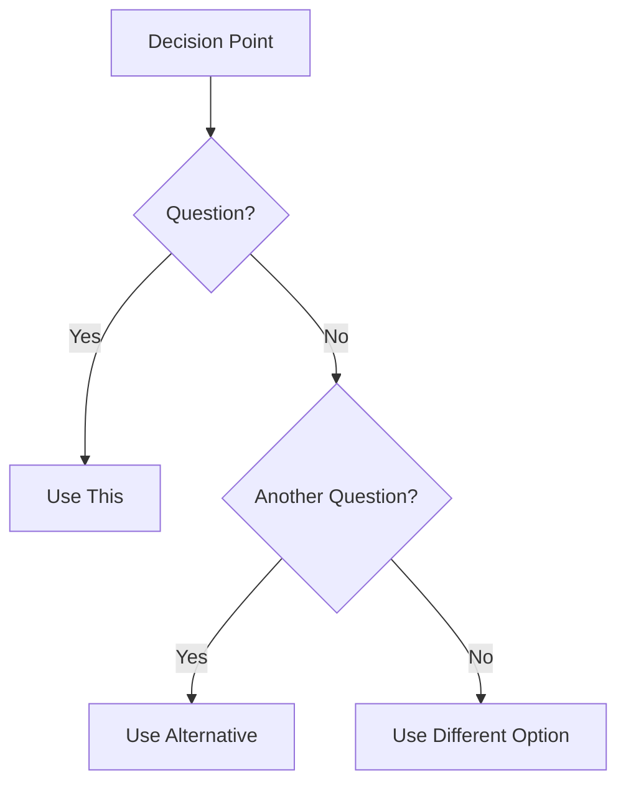
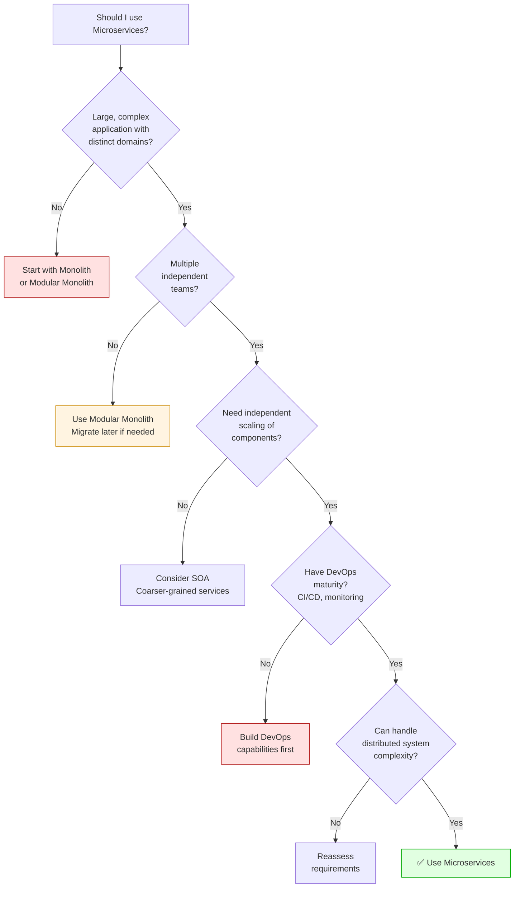

# P2-T01: Add "When to Use" Sections

**Phase:** 2 - Content Enrichment
**Week:** 3 - Decision Support
**Priority:** High
**Effort:** 15 hours
**Status:** Not Started

---

## Objective

Add practical "When to Use" decision frameworks to 10 key technology and pattern pages to help developers make informed architectural and design choices.

## Context

Many pages explain **what** a technology does and **how** it works, but don't address **when** to use it. Developers need guidance on:
- When a technology/pattern is a good fit
- When to avoid it
- What alternatives to consider
- Decision criteria and trade-offs

This fills a critical gap between theory and practice.

## Success Criteria

- [ ] 10 high-impact pages have "When to Use" sections
- [ ] Each section includes: ✅ Good Fit, ❌ Poor Fit, ⚠️ Alternatives
- [ ] Decision flowcharts using Mermaid where appropriate
- [ ] Real-world examples included
- [ ] Consistent format across all pages

## Deliverables

### Pages to Enhance (10 pages)

#### 1. microservices.md
- When to use microservices vs monolith
- Team size considerations
- Complexity trade-offs

#### 2. nosql.md
- SQL vs NoSQL decision criteria
- Data structure considerations
- Scale requirements

#### 3. stream-api.md
- Streams vs traditional loops
- Performance implications
- Collection size guidelines

#### 4. project-reactor.md
- Reactive vs blocking I/O
- When asynchronous is beneficial
- Complexity trade-offs

#### 5. oauth.md
- OAuth vs other auth methods
- When to use different OAuth flows
- Third-party integration scenarios

#### 6. jwt.md
- JWT vs session-based auth
- Stateless vs stateful considerations
- Security trade-offs

#### 7. reactive.md (Reactive Systems)
- When reactive architecture makes sense
- Event-driven requirements
- System scale considerations

#### 8. observer.md (Observer Pattern)
- When observer pattern fits
- Alternatives (callbacks, events)
- Performance considerations

#### 9. relational.md
- When to choose relational databases
- Transaction requirements
- Query complexity needs

#### 10. completable-future.md
- CompletableFuture vs Future
- Synchronous vs asynchronous
- Thread pool considerations

### Standard Format

**Placement:** After main content explanation, before examples section

**Structure:**
```markdown
---

## When to Use [Technology/Pattern Name]

### ✅ Good Fit

**[Scenario Category]**
- Specific situation description
- Example: Real-world use case

[2-4 scenario categories]

### ❌ Poor Fit

**[Anti-scenario Category]**
- Why this is not a good fit
- Example: When to avoid

[2-4 anti-scenarios]

### ⚠️ Consider Alternatives

- **[Alternative 1]**: When to use instead
- **[Alternative 2]**: When to use instead

[Optional: Decision Flowchart]

### Decision Flowchart


```

### Example Implementation: microservices.md

```markdown
---

## When to Use Microservices

### ✅ Good Fit

**Large, Complex Applications**
- System has distinct business domains that can be independently developed
- Multiple bounded contexts with clear boundaries
- **Example:** E-commerce platform (authentication, catalog, cart, payment, shipping, inventory)

**Independent Team Scaling**
- Multiple teams working on different features simultaneously
- Teams need to deploy independently without coordination overhead
- **Example:** Netflix (100+ engineering teams, 1000+ microservices)

**Technology Diversity Requirements**
- Different services have different technology needs
- Ability to choose best tool for each job
- **Example:** Python for ML recommendations, Go for high-performance API gateway, Java for business logic

**Scalability Requirements**
- Different components need to scale independently
- Uneven load distribution across features
- **Example:** Read-heavy product catalog needs 20 instances, write-heavy checkout needs 3

**Fault Isolation Needed**
- Failures in one service shouldn't cascade to others
- Critical path must remain available even if non-critical features fail
- **Example:** Recommendation engine down shouldn't break checkout flow

### ❌ Poor Fit

**Simple CRUD Applications**
- Limited business logic and few domain boundaries
- Straightforward data relationships
- **Example:** Basic blog platform, simple contact management, small internal tool

**Small Team (< 5 developers)**
- Operational overhead outweighs benefits
- Communication overhead increases with distributed system
- **Example:** Startup MVP, side project, small department app

**Tight Coupling Between Domains**
- Most operations require multiple service calls
- Distributed transactions needed frequently
- **Example:** Order processing that always requires inventory, payment, shipping, and notification in single transaction

**Limited DevOps Maturity**
- No CI/CD pipeline or automated testing
- Manual deployment processes
- Limited monitoring and observability tools
- **Example:** Team without container orchestration experience or automated deployment

**Performance-Critical Latency**
- Sub-millisecond response requirements
- Network overhead is unacceptable
- **Example:** High-frequency trading system, real-time gaming server

**Limited Budget/Resources**
- Infrastructure costs (multiple databases, servers, monitoring)
- Maintenance overhead (multiple codebases, deployments)
- **Example:** Non-profit with limited technical resources

### ⚠️ Consider Alternatives

- **Modular Monolith**: Start here, migrate to microservices later if needed. Provides modularity without distribution complexity.
- **Service-Oriented Architecture (SOA)**: Coarser-grained services, fewer network boundaries
- **Serverless Functions**: Event-driven, auto-scaling without managing services (AWS Lambda, Azure Functions)

### Decision Flowchart


```

### Key Considerations

**Team Size Rule of Thumb:**
- 1-5 developers: Monolith
- 5-20 developers: Modular Monolith or few services (2-4)
- 20+ developers: Microservices architecture

**Domain Boundaries:**
- Can identify 3+ distinct bounded contexts
- Each context could have its own data model
- Low coupling between contexts

**Infrastructure Requirements:**
- Container orchestration (Kubernetes, ECS)
- Service mesh (Istio, Linkerd) for complex scenarios
- Centralized logging and monitoring
- API gateway

<sub>[Back to top](#table-of-contents)</sub>

---

[Continue with existing content...]
```

## Technical Requirements

### Content Guidelines
- **Real-world examples**: Use actual companies/scenarios
- **Specific criteria**: Quantifiable when possible (team size, data volume, latency)
- **Honest trade-offs**: Don't oversell, acknowledge complexity
- **Actionable advice**: Clear decision points

### Decision Flowcharts
- Use Mermaid.js for all flowcharts
- Keep simple (5-10 nodes maximum)
- Clear yes/no decision points
- Visual distinction (green for recommended, red for avoid)

### Formatting
- Use emoji for visual scanning (✅❌⚠️)
- Bold scenario categories
- Italic for emphasis on key points
- Code examples where applicable

### Integration
- Place after conceptual explanation, before detailed implementation
- Link to alternative technologies mentioned
- Cross-reference related decision guides

## Acceptance Criteria

**Completeness:**
- [ ] All 10 pages have "When to Use" sections
- [ ] Each has ✅ Good Fit (2-4 scenarios)
- [ ] Each has ❌ Poor Fit (2-4 scenarios)
- [ ] Each has ⚠️ Alternatives (2-3 options)
- [ ] 7+ pages have decision flowcharts

**Quality:**
- [ ] Real-world examples provided
- [ ] Specific criteria (not vague)
- [ ] Balanced perspective (not biased)
- [ ] Actionable recommendations

**Technical:**
- [ ] Mermaid flowcharts render correctly
- [ ] All alternative links work
- [ ] Mobile-friendly formatting
- [ ] Consistent structure across pages

## Testing Checklist

- [ ] Decision flowcharts render on GitHub
- [ ] Examples are realistic and accurate
- [ ] Criteria are measurable/specific
- [ ] No bias toward specific vendors
- [ ] Preview on mobile devices

## Dependencies

**Prerequisites:**
- Understanding of each technology/pattern
- Industry knowledge for realistic examples

**Related Tickets:**
- P1-T01 (Concurrency) - Reference async decision criteria
- P1-T06 (Related topics) - Link to alternatives
- P2-T02 (Common pitfalls) - Complement "when not to use"

## Resources

**Decision Frameworks:**
- Martin Fowler's [Microservices Guide](https://martinfowler.com/microservices/)
- [When to Use Reactive](https://www.reactivemanifesto.org/)
- [CAP Theorem Guide](https://en.wikipedia.org/wiki/CAP_theorem)

**Real-World Examples:**
- [Netflix Tech Blog](https://netflixtechblog.com/)
- [Uber Engineering](https://eng.uber.com/)
- [Airbnb Engineering](https://medium.com/airbnb-engineering)

**Flowchart Tools:**
- [Mermaid Live Editor](https://mermaid.live/)
- [Mermaid Documentation](https://mermaid.js.org/)

## Implementation Steps

1. **Research and gather examples** (3 hours)
   - Review industry blogs for real-world use cases
   - Identify common decision criteria
   - Note anti-patterns and cautionary tales

2. **Create decision flowcharts** (4 hours)
   - Design flowcharts for each topic
   - Test in Mermaid Live Editor
   - Ensure logical flow

3. **Write "When to Use" content** (6 hours)
   - Follow standard format
   - Include specific examples
   - Be balanced and honest

4. **Integration and formatting** (2 hours)
   - Add to each page
   - Maintain consistent formatting
   - Verify all links

## Notes

- Be honest about complexity - don't oversell technologies
- Include team size/budget considerations (often overlooked)
- Quantify where possible (latency numbers, team sizes, data volumes)
- Update based on technology evolution (e.g., serverless maturity)

## Future Enhancements

- Add cost comparison tables
- Include performance benchmarks
- Link to migration guides
- Add "When to migrate from X to Y" guides

## Assignee

TBD (requires broad technical knowledge)

## Due Date

End of Week 3 (Phase 2)
