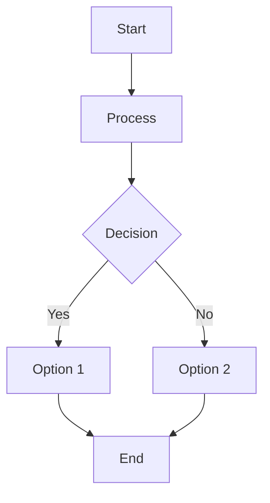
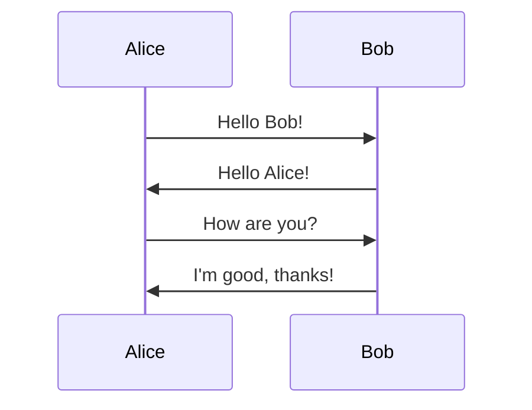
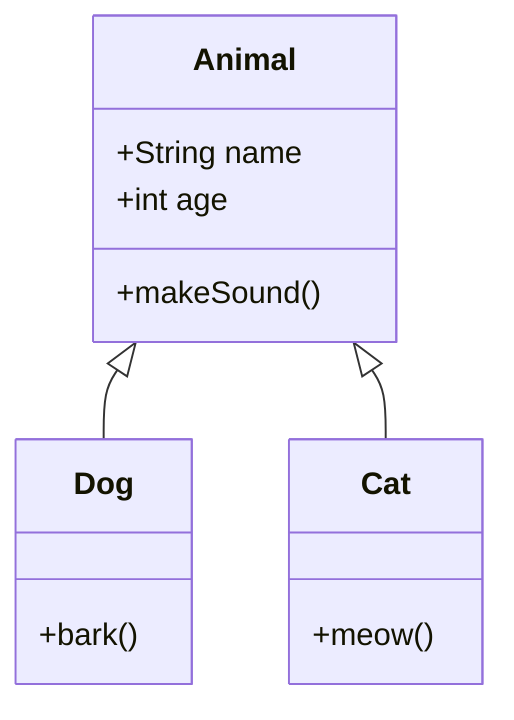
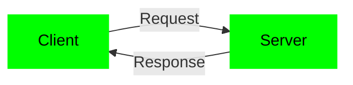


# Mermaid Test Page

This page tests Mermaid.js rendering.

## Test 1: Simple Flowchart

## Test 2: Sequence Diagram

## Test 3: Class Diagram

## Test 4: With Green Theme

---

If you see diagrams above, Mermaid is working! If not, check browser console for errors.

[Back to Home](index.md)
