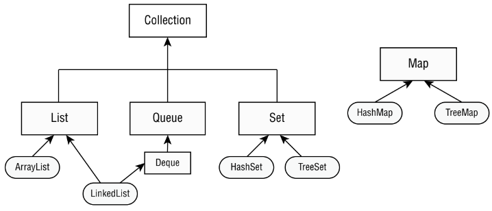

# Collections API

---

## Table of Contents
<!-- TOC -->
* [Collections API](#collections-api)
  * [Table of Contents](#table-of-contents)
  * [Overview](#overview)
  * [Iterable](#iterable)
  * [What's a Collection](#whats-a-collection)
  * [How It Was Originally Collections API?](#how-it-was-originally-collections-api)
    * [List Interface](#list-interface)
    * [Set Interface](#set-interface)
    * [Map Interface](#map-interface)
  * [Explicit Type Casting](#explicit-type-casting)
  * [Updated Java Collections API](#updated-java-collections-api)
  * [Ref.](#ref)
<!-- TOC -->

---

## Overview

Java Collections Framework (commonly referred to as the Collections API) is a set of classes and interfaces in Java that provides various data structures and algorithms to store, manipulate, and process groups of objects.

<sub>[Back to top](#table-of-contents)</sub>


## Iterable

The Iterable interface is the root of the entire collection hierarchy, which means that every class and interface implements it. The primary function of an iterator is to allow the user to traverse through all of the collection class objects as if they were simple sequences of data items.


<sub>[Back to top](#table-of-contents)</sub>


## What's a Collection

The Collection interface extends the Iterable interface. It has the basic methods required for using all the other collections in the framework to add, delete, and manipulate data.

A collection refers to a grouping of objects enclosed within a single entity. The Java Collections Framework represents a set of java.util classes designed to store collections. It comprises four primary interfaces:

- **List**: A list maintains an ordered collection of elements, permitting duplicate entries. Elements within a list can be accessed using integer indices.


- **Set**: A set is a collection that prohibits the inclusion of duplicate entries.


- **Queue**: A queue is a collection that arranges its elements in a specific order for processing. A `Deque` serves as a subinterface of `Queue`, enabling access at both ends.


- **Map**: A map represents a collection that associates keys with corresponding values, allowing no duplication of keys. The elements in a map take the form of key/value pairs.

The Collection interface, its subinterfaces, and some classes that
implement the interfaces:



<sub>[Back to top](#table-of-contents)</sub>


## How It Was Originally Collections API?

In Java 1 (JDK 1.4 and earlier), all collections were essentially collections of Object references. This meant that you could store any type of object in the collections, but you would have to explicitly cast them back to their original type when retrieving elements from the collections. This lack of type-safety often led to runtime errors and made the code more error-prone.

### List Interface

```java
List list = new ArrayList();
list.add("Java");
list.add(42);
String firstElement = (String) list.get(0); // Explicit cast needed
Integer secondElement = (Integer) list.get(1); // Explicit cast needed

```

- Se also: [List Interface](../java-7/list-interface.md)

<sub>[Back to top](#table-of-contents)</sub>


### Set Interface

```java
Set set = new HashSet();
set.add("apple");
set.add(42);
String element = (String) set.iterator().next(); // Explicit cast needed
```

- Se also: [Set Interface](../java-7/set-interface.md)


<sub>[Back to top](#table-of-contents)</sub>


### Map Interface

```java
Map map = new HashMap();
map.put("key", "value");
map.put("number", 42);
String value = (String) map.get("key"); // Explicit cast needed
```

- Se also: [Map Interface](../java-7/map-interface.md)

<sub>[Back to top](#table-of-contents)</sub>

## Explicit Type Casting

As you can see, without generics, you had to rely on **explicit type casting**, which could lead to `ClassCastException` at runtime if the wrong type was used. This lack of compile-time type-checking made the code less reliable and harder to maintain.

Additionally, before generics, the collections **didn't provide any compile-time type safety**, which meant that you could inadvertently insert the wrong type of elements into a collection, leading to unexpected behavior and bugs in the code.

- See also: [Generics](../java-5/generics.md)

<sub>[Back to top](#table-of-contents)</sub>


## Updated Java Collections API

The Java Collections API was updated with the introduction of generics in Java 5 (also known as Java 1.5). Java 5 was released by Sun Microsystems (now Oracle Corporation) in September 2004.

The addition of generics in Java 5 brought significant enhancements to the Collections Framework.

- See also: [Updated Collections API](../java-7/updated-collections.md)
- See also: [Generics](../java-5/generics.md)
- See also: [Diamond Operator](../java-7/diamond-operator.md)
- See also: [Stream API](../java-8/stream-api.md)


## Ref.

https://www.geeksforgeeks.org/how-to-learn-java-collections-a-complete-guide/

---

[Get Started](../../../../../get-started.md) |
[Languages](../../../../../get-started.md#languages) |
[Java Development](../develop.md#reflection-and-dynamic-class-loading) |
[Java 1.2](../versions.md#java-12)

---
