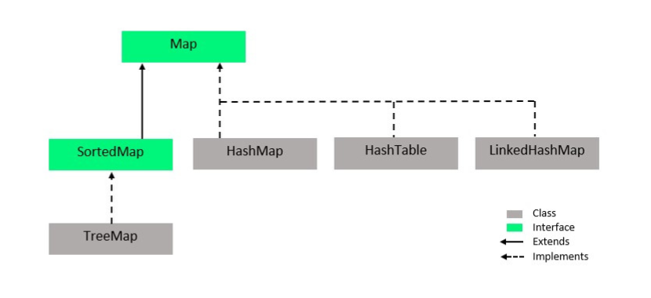

# Updated Collections API

---

## Table of Contents
<!-- TOC -->
* [Updated Collections API](#updated-collections-api)
  * [Table of Contents](#table-of-contents)
  * [Overview](#overview)
  * [Using Common Collection APIs](#using-common-collection-apis)
    * [List Interface](#list-interface)
    * [Set Interface](#set-interface)
    * [Map Interface](#map-interface)
    * [Queue Interface](#queue-interface)
    * [Sorting](#sorting)
    * [Searching and Other Utilities](#searching-and-other-utilities)
  * [Ref.](#ref)
<!-- TOC -->

---

## Overview

The addition of **generics** in Java 5 brought significant enhancements to the Collections Framework.

- See also: [Generics](../java-5/generics.md)

The **diamond operator** is a feature introduced in Java 7 to simplify the usage of generics in collections.

- See also: [Diamond Operator](diamond-operator.md)

<sub>[Back to top](#table-of-contents)</sub>

## Using Common Collection APIs

Common usage of the Collections API in modern Java:





<sub>[Back to top](#table-of-contents)</sub>

### List Interface

The List interface represents an **ordered** collection of elements and **allows duplicate elements**. 

Common implementations include: `ArrayList` and `LinkedList`.

```java
List<String> list = new ArrayList<>();
list.add("Java");
list.add("Python");
list.add("C++");
System.out.println(list); // Output: [Java, Python, C++]
```

<sub>[Back to top](#table-of-contents)</sub>

### Set Interface

The Set interface represents an **unordered** collection of elements with **no duplicates**. 

Common implementations include: `HashSet` and `TreeSet`.

```java
Set<Integer> set = new HashSet<>();
set.add(1);
set.add(2);
set.add(1); // This will not be added as duplicates are not allowed
System.out.println(set); // Output: [1, 2]
```

<sub>[Back to top](#table-of-contents)</sub>


### Map Interface

The Map interface represents a mapping of **keys to values**, where **each key is unique**. 

Common implementations include `HashMap` and `TreeMap`.

```java
Map<String, Integer> map = new HashMap<>();
map.put("apple", 10);
map.put("orange", 5);
System.out.println(map.get("apple")); // Output: 10
```

<sub>[Back to top](#table-of-contents)</sub>


### Queue Interface

The Queue interface represents a collection that holds elements **in a specific order**. 

Common implementations include: `LinkedList` and `PriorityQueue`.

```java
Queue<String> queue = new LinkedList<>();
queue.offer("First");
queue.offer("Second");
System.out.println(queue.poll()); // Output: First
```

<sub>[Back to top](#table-of-contents)</sub>


### Sorting

The Collections class provides sorting methods for lists and arrays.

```java
List<Integer> numbers = Arrays.asList(5, 2, 8, 1, 6);
Collections.sort(numbers);
System.out.println(numbers); // Output: [1, 2, 5, 6, 8]
```

<sub>[Back to top](#table-of-contents)</sub>


### Searching and Other Utilities

The Collections class offers methods for binary search, finding max/min elements, reversing collections, and more.

```java
List<Integer> numbers = Arrays.asList(5, 2, 8, 1, 6);
int index = Collections.binarySearch(numbers, 8);
System.out.println(index); // Output: 4 (index of element 8)

int maxElement = Collections.max(numbers);
System.out.println(maxElement); // Output: 8
```


<sub>[Back to top](#table-of-contents)</sub>


---

## Ref.

https://www.geeksforgeeks.org/how-to-learn-java-collections-a-complete-guide/

---

[Get Started](../../../../../get-started.md) |
[]()
---
