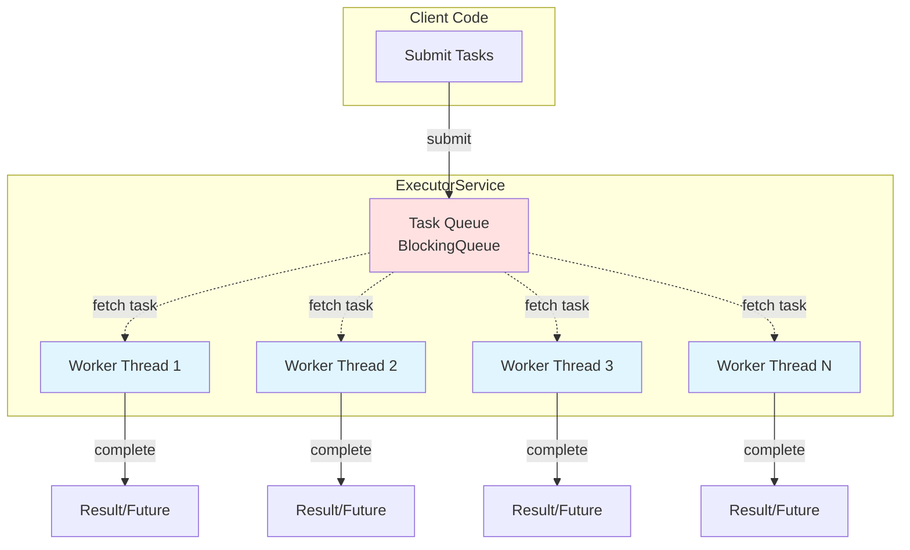

# Executors


---

## Table of Contents
<!-- TOC -->
* [Executors](#executors)
  * [Table of Contents](#table-of-contents)
  * [Overview](#overview)
  * [ExecutorService Interface](#executorservice-interface)
  * [Thread Pool Types](#thread-pool-types)
    * [Fixed Thread Pool](#fixed-thread-pool)
    * [Cached Thread Pool](#cached-thread-pool)
    * [Single Thread Executor](#single-thread-executor)
    * [Scheduled Thread Pool](#scheduled-thread-pool)
  * [Best Practices](#best-practices)
  * [Common Pitfalls](#common-pitfalls)
  * [Thread Pool Architecture](#thread-pool-architecture)
  * [Ref.](#ref)
<!-- TOC -->

---

## Overview

The **Executor framework** provides a higher-level replacement for working with threads directly. Instead of manually creating threads with `new Thread(runnable).start()`, the Executor framework manages thread pools, task queuing, and thread lifecycle.

**Key Benefits:**
- **Thread reuse**: Avoid overhead of creating new threads
- **Resource management**: Control maximum concurrent threads
- **Task queuing**: Handle more tasks than available threads
- **Lifecycle management**: Clean shutdown and termination

The `java.util.concurrent.Executors` class provides factory methods for creating different types of executor services.

<sub>[Back to top](#table-of-contents)</sub>

---

## ExecutorService Interface

The `ExecutorService` extends the `Executor` interface and provides methods for managing task execution and lifecycle.

**Core Methods:**

```java
// Submit tasks
Future<?> submit(Runnable task);
<T> Future<T> submit(Callable<T> task);
<T> Future<T> submit(Runnable task, T result);

// Bulk operations
<T> List<Future<T>> invokeAll(Collection<? extends Callable<T>> tasks);
<T> T invokeAny(Collection<? extends Callable<T>> tasks);

// Lifecycle management
void shutdown();              // Graceful shutdown
List<Runnable> shutdownNow(); // Immediate shutdown
boolean isShutdown();
boolean isTerminated();
boolean awaitTermination(long timeout, TimeUnit unit);
```

<sub>[Back to top](#table-of-contents)</sub>

---

## Thread Pool Types

### Fixed Thread Pool

Creates a thread pool with a **fixed number of threads**. Tasks are queued if all threads are busy.

**When to use:**
- Known workload with consistent concurrency needs
- Want to limit system resources
- Long-running background tasks

```java
ExecutorService executor = Executors.newFixedThreadPool(4);

// Submit tasks
for (int i = 0; i < 10; i++) {
    int taskId = i;
    executor.submit(() -> {
        System.out.println("Task " + taskId + " executed by " +
                          Thread.currentThread().getName());
        // Simulate work
        try {
            Thread.sleep(1000);
        } catch (InterruptedException e) {
            Thread.currentThread().interrupt();
        }
    });
}

// Shutdown gracefully
executor.shutdown();
try {
    if (!executor.awaitTermination(60, TimeUnit.SECONDS)) {
        executor.shutdownNow();
    }
} catch (InterruptedException e) {
    executor.shutdownNow();
    Thread.currentThread().interrupt();
}
```

**Output:** Only 4 threads will execute tasks concurrently, remaining tasks wait in queue.

<sub>[Back to top](#table-of-contents)</sub>

### Cached Thread Pool

Creates a thread pool that creates new threads as needed and reuses previously constructed threads when available.

**When to use:**
- Many short-lived asynchronous tasks
- Number of concurrent tasks varies widely
- Tasks complete quickly

```java
ExecutorService executor = Executors.newCachedThreadPool();

// Submit 100 quick tasks
for (int i = 0; i < 100; i++) {
    int taskId = i;
    executor.submit(() -> {
        System.out.println("Quick task " + taskId + " on " +
                          Thread.currentThread().getName());
    });
}

executor.shutdown();
executor.awaitTermination(10, TimeUnit.SECONDS);
```

**Characteristics:**
- Threads are created on demand
- Idle threads (60 seconds) are terminated
- No limit on thread count (can grow unbounded)
- ⚠️ **Warning**: Can create too many threads under heavy load

<sub>[Back to top](#table-of-contents)</sub>

### Single Thread Executor

Creates an executor that uses a **single worker thread**. Tasks execute sequentially in order.

**When to use:**
- Need guaranteed sequential execution
- Order of operations matters
- Single consumer pattern

```java
ExecutorService executor = Executors.newSingleThreadExecutor();

// These execute one at a time, in order
executor.submit(() -> System.out.println("Task 1"));
executor.submit(() -> System.out.println("Task 2"));
executor.submit(() -> System.out.println("Task 3"));

executor.shutdown();
```

**Use cases:**
- Processing events in order
- Writing to a single file/resource
- Maintaining state without synchronization

<sub>[Back to top](#table-of-contents)</sub>

### Scheduled Thread Pool

Creates a thread pool that can **schedule commands to run after a delay** or execute periodically.

```java
ScheduledExecutorService scheduler = Executors.newScheduledThreadPool(2);

// Execute once after 5 seconds delay
scheduler.schedule(() -> {
    System.out.println("Executed after 5 seconds");
}, 5, TimeUnit.SECONDS);

// Execute periodically every 3 seconds (fixed rate)
ScheduledFuture<?> periodicTask = scheduler.scheduleAtFixedRate(() -> {
    System.out.println("Periodic task: " + System.currentTimeMillis());
}, 0, 3, TimeUnit.SECONDS);

// Execute with fixed delay between executions
scheduler.scheduleWithFixedDelay(() -> {
    System.out.println("Task with fixed delay between executions");
}, 0, 2, TimeUnit.SECONDS);

// Cancel periodic task after 15 seconds
scheduler.schedule(() -> {
    periodicTask.cancel(false);
    scheduler.shutdown();
}, 15, TimeUnit.SECONDS);
```

**Difference between scheduling methods:**
- `scheduleAtFixedRate`: Fixed time between task **starts** (may overlap if task is slow)
- `scheduleWithFixedDelay`: Fixed time between task **completion** and next **start**

<sub>[Back to top](#table-of-contents)</sub>

---

## Best Practices

### 1. Always Shutdown Executors

**❌ Incorrect:**
```java
ExecutorService executor = Executors.newFixedThreadPool(4);
// Submit tasks
// Never shutdown - threads keep JVM alive!
```

**✅ Correct:**
```java
ExecutorService executor = Executors.newFixedThreadPool(4);
try {
    // Submit tasks
    executor.submit(() -> doWork());
} finally {
    executor.shutdown();
    try {
        if (!executor.awaitTermination(60, TimeUnit.SECONDS)) {
            executor.shutdownNow();
        }
    } catch (InterruptedException e) {
        executor.shutdownNow();
        Thread.currentThread().interrupt();
    }
}
```

### 2. Size Thread Pools Appropriately

**CPU-bound tasks:**
```java
int cores = Runtime.getRuntime().availableProcessors();
ExecutorService executor = Executors.newFixedThreadPool(cores);
```

**I/O-bound tasks:**
```java
int cores = Runtime.getRuntime().availableProcessors();
// I/O tasks spend time waiting, so more threads can be beneficial
ExecutorService executor = Executors.newFixedThreadPool(cores * 2);
```

### 3. Handle Rejected Execution

When queue is full or executor is shutdown, tasks may be rejected:

```java
ThreadPoolExecutor executor = new ThreadPoolExecutor(
    2, 4, 60, TimeUnit.SECONDS,
    new LinkedBlockingQueue<>(10),
    new ThreadPoolExecutor.CallerRunsPolicy() // Handle rejection
);
```

**Rejection Policies:**
- `AbortPolicy`: Throws `RejectedExecutionException` (default)
- `CallerRunsPolicy`: Executes task in caller's thread
- `DiscardPolicy`: Silently discards task
- `DiscardOldestPolicy`: Discards oldest unhandled task

### 4. Use Try-With-Resources (Java 19+)

```java
try (ExecutorService executor = Executors.newFixedThreadPool(4)) {
    executor.submit(() -> doWork());
} // Automatically closes (shutdown)
```

<sub>[Back to top](#table-of-contents)</sub>

---

## Common Pitfalls

### ❌ 1. Thread Pool Exhaustion

```java
// BAD: Submitting blocking tasks that wait for each other
ExecutorService executor = Executors.newFixedThreadPool(2);
Future<String> future1 = executor.submit(() -> {
    // This waits for future2 result
    return future2.get(); // DEADLOCK!
});
Future<String> future2 = executor.submit(() -> {
    return "result";
});
```

**Solution:** Use larger pool or separate executors for dependent tasks.

### ❌ 2. Not Handling InterruptedException

```java
// BAD: Swallowing interruption
executor.submit(() -> {
    try {
        Thread.sleep(1000);
    } catch (InterruptedException e) {
        // Ignoring! Thread interrupt status lost
    }
});
```

**✅ Correct:**
```java
executor.submit(() -> {
    try {
        Thread.sleep(1000);
    } catch (InterruptedException e) {
        Thread.currentThread().interrupt(); // Preserve interrupt status
        // Clean up and exit
    }
});
```

### ❌ 3. Cached Thread Pool for Long-Running Tasks

```java
// BAD: Can create thousands of threads
ExecutorService executor = Executors.newCachedThreadPool();
for (int i = 0; i < 10000; i++) {
    executor.submit(() -> {
        // Long-running task (1 minute)
        Thread.sleep(60000);
    });
}
// May create 10,000 threads!
```

**Solution:** Use `newFixedThreadPool` for long-running tasks.

<sub>[Back to top](#table-of-contents)</sub>

---

## Thread Pool Architecture



**How it works:**
1. Client submits tasks to ExecutorService
2. Tasks are placed in a BlockingQueue
3. Worker threads pull tasks from queue
4. Each worker executes its task
5. Results are returned via Future objects
6. Threads are reused for next tasks

<sub>[Back to top](#table-of-contents)</sub>

---

## Ref.

**Official Documentation:**
- [ExecutorService JavaDoc](https://docs.oracle.com/javase/8/docs/api/java/util/concurrent/ExecutorService.html)
- [Executors JavaDoc](https://docs.oracle.com/javase/8/docs/api/java/util/concurrent/Executors.html)
- [Java Concurrency Tutorial](https://docs.oracle.com/javase/tutorial/essential/concurrency/executors.html)

**Guides:**
- [Baeldung: Java ExecutorService Guide](https://www.baeldung.com/java-executor-service-tutorial)
- [Java Concurrency in Practice](https://jcip.net/) - Book by Brian Goetz

---

[Get Started](../../../../../../get-started.md) |
[Java Concurrency](../concurrency.md) |
[Java 8](../../versions.md#java-8-lts)

---
