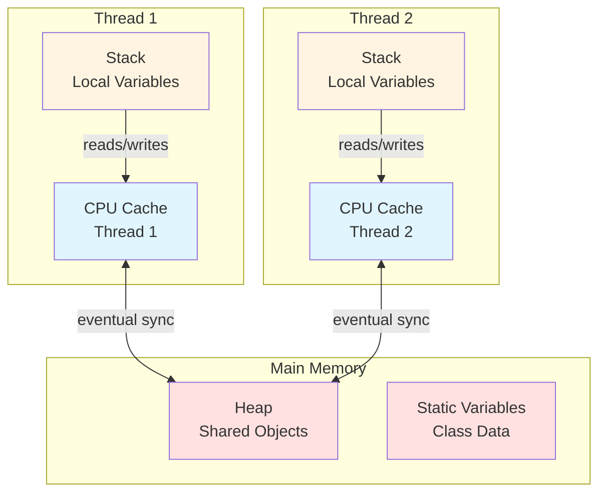
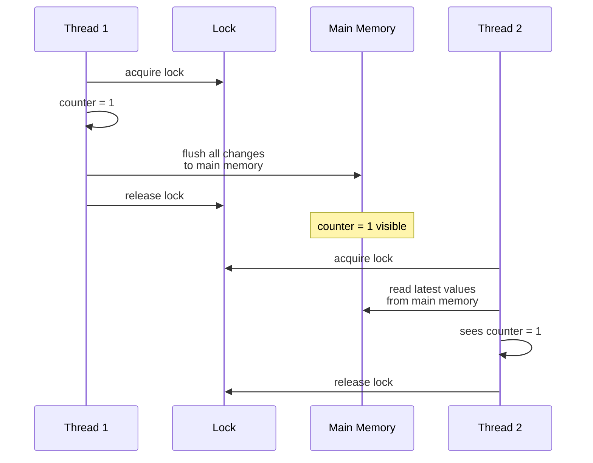

# Java Memory Model


---

## Table of Contents
<!-- TOC -->
* [Java Memory Model](#java-memory-model)
  * [Table of Contents](#table-of-contents)
  * [Overview](#overview)
  * [Thread Memory Architecture](#thread-memory-architecture)
  * [Happens-Before Relationship](#happens-before-relationship)
  * [Volatile Keyword](#volatile-keyword)
  * [Synchronized Blocks](#synchronized-blocks)
  * [ThreadLocal](#threadlocal)
  * [Common Visibility Problems](#common-visibility-problems)
  * [Best Practices](#best-practices)
  * [Ref.](#ref)
<!-- TOC -->

---

## Overview

The **Java Memory Model (JMM)** defines how threads interact with memory, ensuring **consistency and visibility** of shared data across threads.

**Why It Matters:**
- Threads have their own cache (CPU registers, L1/L2 cache)
- Changes in one thread may not be visible to other threads
- JMM defines rules for when changes become visible
- Critical for writing correct concurrent programs

**Key Concepts:**
- **Visibility**: When changes made by one thread are visible to others
- **Ordering**: The order in which operations appear to execute
- **Happens-before**: Guarantees about memory visibility
- **Atomicity**: Operations that appear indivisible

<sub>[Back to top](#table-of-contents)</sub>

---

## Thread Memory Architecture



**How It Works:**
1. Each thread has its own **stack** (local variables, method calls)
2. Each thread works with **CPU caches** for performance
3. Shared data lives in **main memory** (heap)
4. Caches are synchronized with main memory **eventually** (not immediately!)
5. Without synchronization, changes may not be visible across threads

### Example of Visibility Problem

```java
public class VisibilityExample {
    private static boolean ready = false;
    private static int number = 0;

    public static void main(String[] args) throws InterruptedException {
        // Thread 1: Writer
        new Thread(() -> {
            number = 42;
            ready = true; // Signal that value is ready
        }).start();

        // Thread 2: Reader
        new Thread(() -> {
            while (!ready) {
                // Busy wait
            }
            System.out.println(number); // May print 0! Visibility issue
        }).start();
    }
}
```

**Problem:** Thread 2 may never see `ready = true` or may see `ready = true` but `number = 0` because changes aren't guaranteed to be visible without synchronization.

<sub>[Back to top](#table-of-contents)</sub>

---

## Happens-Before Relationship

**Happens-before** is a guarantee that memory writes by one specific statement are visible to another.

### Happens-Before Rules

1. **Program Order Rule**: Each action in a thread happens-before every subsequent action in that thread
   ```java
   int a = 1;   // Happens-before
   int b = 2;   // this line
   ```

2. **Volatile Variable Rule**: A write to a volatile field happens-before every subsequent read of that field
   ```java
   volatile boolean flag = false;

   // Thread 1
   data = 42;
   flag = true; // Write to volatile

   // Thread 2
   if (flag) {  // Read from volatile
       // Guaranteed to see data = 42
   }
   ```

3. **Thread Start Rule**: `thread.start()` happens-before any action in the started thread

4. **Thread Join Rule**: All actions in a thread happen-before any other thread returns from `thread.join()`

5. **Monitor Lock Rule**: Unlock on a monitor happens-before every subsequent lock on that same monitor
   ```java
   synchronized (lock) {
       // Unlock at end happens-before
   }
   synchronized (lock) {
       // next lock on same monitor
   }
   ```

6. **Transitivity**: If A happens-before B, and B happens-before C, then A happens-before C

<sub>[Back to top](#table-of-contents)</sub>

---

## Volatile Keyword

**volatile** ensures visibility and prevents reordering for a variable.

### What volatile Does

- **Visibility**: Writes are immediately visible to all threads
- **No Caching**: Always reads from/writes to main memory
- **Ordering**: Prevents reordering of operations around volatile access

### When to Use volatile

```java
public class VolatileExample {
    private volatile boolean shutdown = false;

    public void shutdown() {
        shutdown = true; // Immediately visible to all threads
    }

    public void doWork() {
        while (!shutdown) {
            // Process work
            // Will see shutdown = true without delay
        }
    }
}
```

**Good Use Cases:**
- Status flags (shutdown, initialized)
- State that doesn't depend on current value
- Single writer, multiple readers

### When volatile Is NOT Enough

```java
// ❌ NOT thread-safe even with volatile
private volatile int counter = 0;

public void increment() {
    counter++; // Read-modify-write is NOT atomic!
    // This is actually: counter = counter + 1 (3 operations)
}

// ✅ Use AtomicInteger instead
private AtomicInteger counter = new AtomicInteger(0);

public void increment() {
    counter.incrementAndGet(); // Atomic
}
```

### Volatile vs Atomic

| Feature | volatile | AtomicInteger |
|---------|----------|---------------|
| Visibility | ✅ Yes | ✅ Yes |
| Atomicity | ❌ No | ✅ Yes |
| Read-Modify-Write | ❌ Not safe | ✅ Safe |
| Use Case | Status flags | Counters, sequences |

<sub>[Back to top](#table-of-contents)</sub>

---

## Synchronized Blocks

**synchronized** provides both **mutual exclusion** (locks) and **memory visibility**.

### Synchronized Method

```java
public class Counter {
    private int count = 0;

    // Only one thread can execute this at a time
    public synchronized void increment() {
        count++; // Protected by lock
    }

    public synchronized int getCount() {
        return count; // Sees latest value due to synchronization
    }
}
```

### Synchronized Block

```java
public class BankAccount {
    private double balance = 0;
    private final Object lock = new Object();

    public void deposit(double amount) {
        synchronized (lock) {
            balance += amount;
        } // Unlock happens here - makes change visible
    }

    public double getBalance() {
        synchronized (lock) {
            return balance; // Lock ensures we see latest value
        }
    }
}
```

### Memory Visibility with Synchronized



**Key Point:** Synchronized doesn't just provide mutual exclusion - it also ensures **memory visibility** by flushing and reloading from main memory at lock boundaries.

<sub>[Back to top](#table-of-contents)</sub>

---

## ThreadLocal

**ThreadLocal** provides thread-local variables where each thread has its own independent copy.

### Basic Usage

```java
public class ThreadLocalExample {
    // Each thread gets its own UserContext
    private static ThreadLocal<UserContext> userContext = new ThreadLocal<>();

    public static void setUser(UserContext context) {
        userContext.set(context);
    }

    public static UserContext getUser() {
        return userContext.get(); // Thread-safe, no locking needed
    }

    public static void clear() {
        userContext.remove(); // Important: prevent memory leaks
    }
}

// Usage
ThreadLocalExample.setUser(new UserContext("user123"));
// Only this thread sees this value
UserContext user = ThreadLocalExample.getUser();
ThreadLocalExample.clear(); // Clean up when done
```

### Thread-Local Transaction Example

```java
public class TransactionManager {
    private static ThreadLocal<Transaction> currentTransaction = new ThreadLocal<>();

    public static void beginTransaction() {
        Transaction tx = new Transaction();
        currentTransaction.set(tx);
    }

    public static void commitTransaction() {
        Transaction tx = currentTransaction.get();
        if (tx != null) {
            tx.commit();
            currentTransaction.remove(); // Clean up
        }
    }

    public static Transaction getTransaction() {
        return currentTransaction.get();
    }
}
```

### ThreadLocal with Initial Value

```java
private static ThreadLocal<SimpleDateFormat> dateFormat =
    ThreadLocal.withInitial(() -> new SimpleDateFormat("yyyy-MM-dd"));

// Each thread gets its own SimpleDateFormat instance
String formatted = dateFormat.get().format(new Date());
```

**Use Cases:**
- Per-thread context (user session, transaction)
- Thread-safe instances of non-thread-safe objects (SimpleDateFormat)
- Performance (avoid synchronization)

**⚠️ Warning:** Always call `remove()` in finally blocks to prevent memory leaks, especially in thread pools.

<sub>[Back to top](#table-of-contents)</sub>

---

## Common Visibility Problems

### 1. Lost Updates

```java
// ❌ NOT thread-safe
public class Counter {
    private int count = 0;

    public void increment() {
        count++; // Read, modify, write - not atomic!
    }
}

// Two threads both reading count=0, both writing count=1
// One increment is lost!
```

**Solution:** Use `synchronized` or `AtomicInteger`.

### 2. Stale Reads

```java
// ❌ May read stale value
public class ConfigManager {
    private boolean debugEnabled = false;

    public void enableDebug() {
        debugEnabled = true; // Change may not be visible
    }

    public void doWork() {
        if (debugEnabled) { // May see false even after enableDebug()
            // Debug logic
        }
    }
}
```

**Solution:** Make `debugEnabled` volatile.

### 3. Partially Constructed Objects

```java
// ❌ Unsafe publication
public class UnsafePublisher {
    public static MyObject instance;

    public static void initialize() {
        instance = new MyObject(); // Can be partially visible!
    }
}

// Another thread may see instance != null but with uninitialized fields!
```

**Solution:** Use `volatile`, `synchronized`, or proper initialization idioms (static final).

### 4. Double-Checked Locking (Broken)

```java
// ❌ BROKEN in Java < 5 or without volatile
public class Singleton {
    private static Singleton instance;

    public static Singleton getInstance() {
        if (instance == null) { // Check 1
            synchronized (Singleton.class) {
                if (instance == null) { // Check 2
                    instance = new Singleton(); // Can be partially visible!
                }
            }
        }
        return instance;
    }
}

// ✅ Fixed with volatile (Java 5+)
public class Singleton {
    private static volatile Singleton instance; // volatile fixes it

    public static Singleton getInstance() {
        if (instance == null) {
            synchronized (Singleton.class) {
                if (instance == null) {
                    instance = new Singleton();
                }
            }
        }
        return instance;
    }
}
```

<sub>[Back to top](#table-of-contents)</sub>

---

## Best Practices

### 1. Use High-Level Concurrency Utilities

```java
// ✅ Prefer java.util.concurrent classes
AtomicInteger counter = new AtomicInteger();
ConcurrentHashMap<String, Value> map = new ConcurrentHashMap<>();
```

### 2. Minimize Mutable Shared State

```java
// ✅ Immutable objects are inherently thread-safe
public final class ImmutablePoint {
    private final int x;
    private final int y;

    public ImmutablePoint(int x, int y) {
        this.x = x;
        this.y = y;
    }

    // Only getters, no setters
    public int getX() { return x; }
    public int getY() { return y; }
}
```

### 3. Use Volatile for Simple Flags

```java
// ✅ Good use of volatile
private volatile boolean shutdown = false;

public void shutdown() {
    shutdown = true;
}

public void run() {
    while (!shutdown) {
        // Work
    }
}
```

### 4. Always Clean Up ThreadLocal

```java
// ✅ Always remove ThreadLocal values
try {
    threadLocal.set(value);
    // Use value
} finally {
    threadLocal.remove(); // Prevent memory leaks
}
```

### 5. Document Thread-Safety

```java
/**
 * This class is thread-safe. All public methods are synchronized.
 */
public class ThreadSafeCounter {
    // Implementation
}

/**
 * This class is NOT thread-safe. External synchronization required.
 */
public class UnsafeCounter {
    // Implementation
}
```

<sub>[Back to top](#table-of-contents)</sub>

---

## Ref.

**Official Documentation:**
- [Java Memory Model FAQ](https://www.cs.umd.edu/~pugh/java/memoryModel/)
- [JSR 133 (Java Memory Model)](https://jcp.org/en/jsr/detail?id=133)
- [Java Language Specification - Chapter 17](https://docs.oracle.com/javase/specs/jls/se8/html/jls-17.html)

**Essential Reading:**
- [Java Concurrency in Practice](https://jcip.net/) - Chapter 16 (The Java Memory Model)
- [The JSR-133 Cookbook](http://gee.cs.oswego.edu/dl/jmm/cookbook.html)

**Guides:**
- [Baeldung: Java Memory Model](https://www.baeldung.com/java-memory-model)
- [Jenkov: Java Memory Model](https://jenkov.com/tutorials/java-concurrency/java-memory-model.html)
- [DZone: Understanding Java Memory Model](https://dzone.com/articles/java-memory-model)

**Related Topics:**
- [Volatile keyword usage](https://docs.oracle.com/javase/tutorial/essential/concurrency/atomic.html)
- [Synchronized blocks](https://docs.oracle.com/javase/tutorial/essential/concurrency/locksync.html)
- [Atomic variables](https://docs.oracle.com/javase/8/docs/api/java/util/concurrent/atomic/package-summary.html)

---

[Get Started](../../../../../../get-started.md) |
[Java Concurrency](../../concurrency.md) |
[Java 8](../../versions.md#java-8-lts)

---
