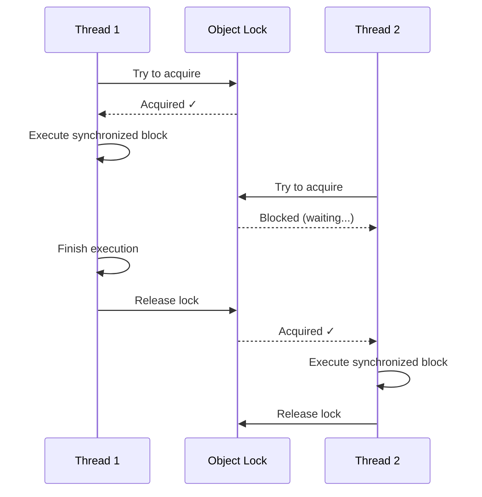

# Thread Synchronization


---

## Table of Contents
<!-- TOC -->
* [Thread Synchronization](#thread-synchronization)
  * [Table of Contents](#table-of-contents)
  * [Overview](#overview)
  * [The Need for Synchronization](#the-need-for-synchronization)
  * [Synchronized Methods](#synchronized-methods)
  * [Synchronized Blocks](#synchronized-blocks)
  * [Intrinsic Locks (Monitors)](#intrinsic-locks-monitors)
  * [Inter-Thread Communication](#inter-thread-communication)
  * [wait() and notify()](#wait-and-notify)
  * [Producer-Consumer Pattern](#producer-consumer-pattern)
  * [Best Practices](#best-practices)
  * [Common Pitfalls](#common-pitfalls)
  * [Ref.](#ref)
<!-- TOC -->

---

## Overview

**Thread synchronization** is a mechanism to control access to shared resources in a multi-threaded environment, ensuring that only one thread can access a resource at a time when necessary.

**Key Concepts:**
- **Intrinsic Lock (Monitor)**: Every Java object has an associated lock
- **synchronized keyword**: Acquires the lock automatically
- **Mutual Exclusion**: Only one thread executes synchronized code at a time
- **Visibility**: Changes made by one thread are visible to other threads
- **wait/notify**: Inter-thread communication mechanisms

**Why Synchronization Matters:**
```java
// Without synchronization - UNSAFE!
class Counter {
    private int count = 0;

    public void increment() {
        count++;  // Read-Modify-Write: NOT atomic!
    }
}

// With synchronization - SAFE
class Counter {
    private int count = 0;

    public synchronized void increment() {
        count++;  // Now thread-safe
    }
}
```

<sub>[Back to top](#table-of-contents)</sub>

---

## The Need for Synchronization

### Race Condition Example

Without synchronization, multiple threads accessing shared data can cause **race conditions**:

```java
public class BankAccount {
    private int balance = 1000;

    // UNSAFE - Race condition!
    public void withdraw(int amount) {
        if (balance >= amount) {           // Thread 1 checks: 1000 >= 500 ✓
            // Context switch here!
            balance = balance - amount;     // Thread 1: 1000 - 500 = 500
        }                                   // Thread 2: 1000 - 600 = 400 (Lost update!)
    }
}
```

**Problem:**
1. Thread 1 checks balance (1000 >= 500) ✓
2. Thread 1 gets interrupted before update
3. Thread 2 checks balance (1000 >= 600) ✓
4. Thread 2 withdraws 600 → balance = 400
5. Thread 1 resumes, withdraws 500 → balance = -100 (Overdrawn!)

### Solution with Synchronization

```java
public class BankAccount {
    private int balance = 1000;

    // SAFE - synchronized ensures atomicity
    public synchronized void withdraw(int amount) {
        if (balance >= amount) {
            balance = balance - amount;  // Atomic operation
        }
    }

    public synchronized int getBalance() {
        return balance;  // Must also be synchronized for visibility
    }
}
```

<sub>[Back to top](#table-of-contents)</sub>

---

## Synchronized Methods

**Synchronized methods** lock the entire object (or class for static methods).

### Instance Method Synchronization

```java
public class SynchronizedCounter {
    private int count = 0;

    // Locks on 'this' object
    public synchronized void increment() {
        count++;
    }

    public synchronized void decrement() {
        count--;
    }

    public synchronized int getCount() {
        return count;
    }
}
```

**Equivalent to:**
```java
public void increment() {
    synchronized (this) {
        count++;
    }
}
```

### Static Method Synchronization

```java
public class StaticCounter {
    private static int count = 0;

    // Locks on StaticCounter.class object
    public static synchronized void increment() {
        count++;
    }

    public static synchronized int getCount() {
        return count;
    }
}
```

**Equivalent to:**
```java
public static void increment() {
    synchronized (StaticCounter.class) {
        count++;
    }
}
```

<sub>[Back to top](#table-of-contents)</sub>

---

## Synchronized Blocks

**Synchronized blocks** provide more fine-grained control over locking.

### Basic Syntax

```java
synchronized (lockObject) {
    // Critical section
    // Only one thread can execute this at a time
}
```

### Example: Partial Synchronization

```java
public class BankAccount {
    private int balance = 1000;
    private final Object balanceLock = new Object();

    public void withdraw(int amount) {
        // Pre-processing (can be concurrent)
        validateAmount(amount);
        logWithdrawal(amount);

        // Only synchronize the critical section
        synchronized (balanceLock) {
            if (balance >= amount) {
                balance -= amount;
            }
        }

        // Post-processing (can be concurrent)
        notifyCustomer();
    }
}
```

**Benefits:**
- Reduced lock contention
- Better concurrency
- Only protects what needs protection

### Multiple Locks for Better Concurrency

```java
public class BankAccount {
    private int balance = 1000;
    private List<Transaction> transactions = new ArrayList<>();

    private final Object balanceLock = new Object();
    private final Object transactionsLock = new Object();

    public void withdraw(int amount) {
        synchronized (balanceLock) {
            balance -= amount;
        }
    }

    public void addTransaction(Transaction tx) {
        synchronized (transactionsLock) {
            transactions.add(tx);
        }
    }

    // Different locks allow concurrent balance operations and transaction logging!
}
```

<sub>[Back to top](#table-of-contents)</sub>

---

## Intrinsic Locks (Monitors)

Every Java object has an **intrinsic lock** (also called a **monitor**).

### How Intrinsic Locks Work



### Reentrancy

Intrinsic locks are **reentrant**: a thread can acquire the same lock multiple times.

```java
public class ReentrantExample {
    public synchronized void methodA() {
        System.out.println("Method A");
        methodB();  // Can call another synchronized method
    }

    public synchronized void methodB() {
        System.out.println("Method B");  // Same thread can reacquire lock
    }
}
```

**Without reentrancy, this would deadlock!** But Java's intrinsic locks track ownership and allow the same thread to enter.

### Lock Ownership

```java
public class LockOwnership {
    public void demonstrateOwnership() {
        synchronized (this) {
            // Thread owns the lock
            synchronized (this) {  // Same thread can reacquire
                synchronized (this) {  // And again...
                    System.out.println("Nested locks work!");
                }
            }
        }  // Lock released once (reference count = 0)
    }
}
```

<sub>[Back to top](#table-of-contents)</sub>

---

## Inter-Thread Communication

Threads often need to **coordinate** their actions. Java provides `wait()`, `notify()`, and `notifyAll()` for this purpose.

### The Problem: Busy Waiting

```java
// BAD: Wastes CPU cycles
public class DataProcessor {
    private String data = null;

    public void waitForData() {
        while (data == null) {
            // Busy wait - wastes CPU!
        }
        processData(data);
    }
}
```

### The Solution: wait() and notify()

```java
// GOOD: Efficient waiting
public class DataProcessor {
    private String data = null;

    public synchronized void waitForData() throws InterruptedException {
        while (data == null) {
            wait();  // Releases lock and waits
        }
        processData(data);
    }

    public synchronized void setData(String newData) {
        this.data = newData;
        notify();  // Wake up waiting thread
    }
}
```

<sub>[Back to top](#table-of-contents)</sub>

---

## wait() and notify()

### wait() Method

**Purpose:** Causes the current thread to wait until another thread invokes `notify()` or `notifyAll()`.

**Key Points:**
- Must be called from synchronized context
- Releases the lock while waiting
- Reacquires lock before returning
- Can be interrupted (throws InterruptedException)

```java
synchronized (lock) {
    while (!condition) {
        lock.wait();  // Release lock and wait
    }
    // Lock reacquired here
    // Condition is true, proceed
}
```

### notify() vs notifyAll()

**notify()**: Wakes up **one** waiting thread (arbitrary choice)
```java
synchronized (lock) {
    condition = true;
    lock.notify();  // Wakes one thread
}
```

**notifyAll()**: Wakes up **all** waiting threads
```java
synchronized (lock) {
    condition = true;
    lock.notifyAll();  // Wakes all threads
}
```

**When to use which:**
- Use `notifyAll()` when multiple threads might be waiting
- Use `notify()` only if you're certain only one thread is waiting
- **When in doubt, use `notifyAll()`** (safer)

### Complete Example

```java
public class WaitNotifyDemo {
    private final Object lock = new Object();
    private boolean dataReady = false;
    private String data;

    // Consumer thread
    public void consume() throws InterruptedException {
        synchronized (lock) {
            while (!dataReady) {  // Always use 'while', not 'if'!
                System.out.println("Waiting for data...");
                lock.wait();
            }
            System.out.println("Got data: " + data);
            dataReady = false;
        }
    }

    // Producer thread
    public void produce(String newData) {
        synchronized (lock) {
            this.data = newData;
            this.dataReady = true;
            System.out.println("Data produced: " + data);
            lock.notifyAll();  // Wake up waiting consumers
        }
    }
}
```

**Why `while` instead of `if`?**
- **Spurious wakeups**: Thread can wake up without notify()
- **Multiple conditions**: Condition might change between wakeup and lock reacquisition
- **Multiple waiters**: Another thread might consume the condition

<sub>[Back to top](#table-of-contents)</sub>

---

## Producer-Consumer Pattern

Classic concurrency pattern using wait/notify:

```java
import java.util.LinkedList;
import java.util.Queue;

public class ProducerConsumer {
    private final Queue<Integer> queue = new LinkedList<>();
    private final int capacity = 10;
    private final Object lock = new Object();

    // Producer
    public void produce(int value) throws InterruptedException {
        synchronized (lock) {
            // Wait if queue is full
            while (queue.size() == capacity) {
                System.out.println("Queue full, producer waiting...");
                lock.wait();
            }

            queue.add(value);
            System.out.println("Produced: " + value);

            // Notify consumers
            lock.notifyAll();
        }
    }

    // Consumer
    public int consume() throws InterruptedException {
        synchronized (lock) {
            // Wait if queue is empty
            while (queue.isEmpty()) {
                System.out.println("Queue empty, consumer waiting...");
                lock.wait();
            }

            int value = queue.remove();
            System.out.println("Consumed: " + value);

            // Notify producers
            lock.notifyAll();

            return value;
        }
    }
}

// Usage
public class Demo {
    public static void main(String[] args) {
        ProducerConsumer pc = new ProducerConsumer();

        // Producer thread
        Thread producer = new Thread(() -> {
            try {
                for (int i = 0; i < 20; i++) {
                    pc.produce(i);
                    Thread.sleep(100);
                }
            } catch (InterruptedException e) {
                Thread.currentThread().interrupt();
            }
        });

        // Consumer thread
        Thread consumer = new Thread(() -> {
            try {
                for (int i = 0; i < 20; i++) {
                    pc.consume();
                    Thread.sleep(200);
                }
            } catch (InterruptedException e) {
                Thread.currentThread().interrupt();
            }
        });

        producer.start();
        consumer.start();
    }
}
```

**Modern Alternative:** Use `BlockingQueue` from `java.util.concurrent`:

```java
BlockingQueue<Integer> queue = new ArrayBlockingQueue<>(10);

// Producer
queue.put(value);  // Blocks if full

// Consumer
int value = queue.take();  // Blocks if empty
```

<sub>[Back to top](#table-of-contents)</sub>

---

## Best Practices

### 1. Keep Synchronized Blocks Small

```java
// BAD: Holding lock too long
public synchronized void processLargeFile() {
    readFile();           // I/O - slow!
    processData();        // CPU intensive
    writeResults();       // I/O - slow!
}

// GOOD: Minimize synchronized region
public void processLargeFile() {
    Data data = readFile();  // No lock needed
    Data processed = processData();  // No lock needed

    synchronized (this) {
        // Only synchronize critical section
        updateSharedState(processed);
    }

    writeResults();  // No lock needed
}
```

### 2. Avoid Synchronizing on Public Objects

```java
// BAD: External code can lock on this
public class Counter {
    public synchronized void increment() {  // Locks on 'this'
        count++;
    }
}

// External code can cause problems:
Counter counter = new Counter();
synchronized (counter) {  // Blocks increment()!
    // Long operation
}

// GOOD: Use private lock
public class Counter {
    private final Object lock = new Object();
    private int count = 0;

    public void increment() {
        synchronized (lock) {  // Private lock
            count++;
        }
    }
}
```

### 3. Always Use while, Not if

```java
// BAD: Spurious wakeups can cause issues
synchronized (lock) {
    if (!condition) {
        lock.wait();
    }
    // Condition might be false here!
}

// GOOD: Recheck condition in loop
synchronized (lock) {
    while (!condition) {
        lock.wait();
    }
    // Condition guaranteed to be true
}
```

### 4. Document Thread Safety

```java
/**
 * Thread-safe counter using synchronized methods.
 * All public methods are synchronized.
 */
public class Counter {
    private int count = 0;

    public synchronized void increment() {
        count++;
    }
}
```

### 5. Prefer Higher-Level Utilities

```java
// Instead of manual synchronization:
private final Object lock = new Object();
private int count = 0;

public void increment() {
    synchronized (lock) {
        count++;
    }
}

// Use AtomicInteger:
private final AtomicInteger count = new AtomicInteger(0);

public void increment() {
    count.incrementAndGet();  // Lock-free!
}
```

**See also:** [Atomic Variables](atomic-variables.md)

<sub>[Back to top](#table-of-contents)</sub>

---

## Common Pitfalls

### ❌ 1. Deadlock with Multiple Locks

```java
// BAD: Can deadlock
public class Transfer {
    public void transfer(Account from, Account to, int amount) {
        synchronized (from) {
            synchronized (to) {  // Lock ordering problem!
                from.debit(amount);
                to.credit(amount);
            }
        }
    }
}

// Thread 1: transfer(A, B, 100)  → locks A, waits for B
// Thread 2: transfer(B, A, 50)   → locks B, waits for A
// DEADLOCK!

// GOOD: Consistent lock ordering
public void transfer(Account from, Account to, int amount) {
    Account first = from.getId() < to.getId() ? from : to;
    Account second = from.getId() < to.getId() ? to : from;

    synchronized (first) {
        synchronized (second) {
            from.debit(amount);
            to.credit(amount);
        }
    }
}
```

### ❌ 2. Calling notify() Without Holding Lock

```java
// WRONG: IllegalMonitorStateException!
public void produce(String data) {
    this.data = data;
    lock.notify();  // Must be in synchronized block!
}

// CORRECT:
public void produce(String data) {
    synchronized (lock) {
        this.data = data;
        lock.notify();
    }
}
```

### ❌ 3. Not Handling InterruptedException

```java
// BAD: Swallowing interruption
try {
    lock.wait();
} catch (InterruptedException e) {
    // Ignoring!
}

// GOOD: Restore interrupt status
try {
    lock.wait();
} catch (InterruptedException e) {
    Thread.currentThread().interrupt();  // Restore interrupt flag
    throw new RuntimeException("Interrupted", e);
}
```

### ❌ 4. Synchronizing on null or Changing Reference

```java
// BAD: lock can be null or change
private Object lock = new Object();

public void update() {
    synchronized (lock) {  // What if lock is null?
        // ...
    }
}

public void changeLock() {
    lock = new Object();  // Breaks synchronization!
}

// GOOD: final lock object
private final Object lock = new Object();
```

<sub>[Back to top](#table-of-contents)</sub>

---

## Ref.

**Official Documentation:**
- [Java Language Specification - Synchronization](https://docs.oracle.com/javase/specs/jls/se8/html/jls-17.html#jls-17.1)
- [Object.wait() JavaDoc](https://docs.oracle.com/javase/8/docs/api/java/lang/Object.html#wait--)
- [Object.notify() JavaDoc](https://docs.oracle.com/javase/8/docs/api/java/lang/Object.html#notify--)

**Books:**
- [Java Concurrency in Practice](https://jcip.net/) - Chapter 14 (Intrinsic Locks)
- [Effective Java](https://www.oreilly.com/library/view/effective-java/9780134686097/) - Item 79-82 (Concurrency)

**Guides:**
- [Oracle Java Tutorials - Synchronization](https://docs.oracle.com/javase/tutorial/essential/concurrency/sync.html)
- [Baeldung: Guide to synchronized Keyword](https://www.baeldung.com/java-synchronized)
- [Baeldung: wait and notify](https://www.baeldung.com/java-wait-notify)

**Related Topics:**
- [Java Memory Model](java-memory-model.md) - Understanding visibility guarantees
- [Locks and Conditions](locks-and-conditions.md) - More flexible locking
- [Atomic Variables](atomic-variables.md) - Lock-free thread safety
- [Threads](threads.md) - Thread basics and lifecycle

---

[Get Started](../../../../../../get-started.md) |
[Java Concurrency](../concurrency.md) |
[Java 8](../../versions.md#java-8-lts)

---
