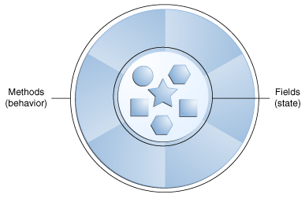

# OOP in Java


---

## Table of Contents
<!-- TOC -->
* [OOP in Java](#oop-in-java)
  * [Table of Contents](#table-of-contents)
  * [What Is an Object?](#what-is-an-object)
  * [What Is a Class?](#what-is-a-class)
  * [What Is Inheritance?](#what-is-inheritance)
  * [What Is an Interface?](#what-is-an-interface)
  * [What Is a Package?](#what-is-a-package)
  * [Ref.](#ref)
<!-- TOC -->

___

## What Is a Class?
A class is a blueprint or prototype from which objects are created.

The following Bicycle class is one possible implementation of a bicycle:

```java
class Bicycle {

    int cadence = 0;
    int speed = 0;
    int gear = 1;

    void changeCadence(int newValue) {
         cadence = newValue;
    }

    void changeGear(int newValue) {
         gear = newValue;
    }

    void speedUp(int increment) {
         speed = speed + increment;   
    }

    void applyBrakes(int decrement) {
         speed = speed - decrement;
    }

    void printStates() {
         System.out.println("cadence:" +
             cadence + " speed:" + 
             speed + " gear:" + gear);
    }
}
```

The fields cadence, speed, and gear represent the object's state, and the methods (changeCadence, changeGear, speedUp etc.) define its interaction with the outside world.
[^3]

<sub>[Back to top](#table-of-contents)</sub>

## What Is an Object?
An object is a software bundle of related state and behavior. Software objects are often used to model the real-world objects that you find in everyday life.

Software objects are conceptually similar to real-world objects: they too consist of state and related behavior. An object stores its state in fields (variables in some programming languages) and exposes its behavior through methods (functions in some programming languages)

Methods operate on an object's internal state and serve as the primary mechanism for object-to-object communication. Hiding internal state and requiring all interaction to be performed through an object's methods is known as data encapsulation



To instance an object of the class Bicycle above, the syntax is:

```java
  Bicycle bike = new Bicycle();
```

First `Bicycle` establish the object type, the `=` operator assigns the object reference to be created to the variable `bike`, then `Bicycle()` stands for the calling of Bicycle constructor.


[^2]

<sub>[Back to top](#table-of-contents)</sub>

## What Is Inheritance?
Object-oriented programming allows classes to inherit commonly used state and behavior from other classes.


The syntax for creating a subclass is simple.

```java
class MountainBike extends Bicycle {

    // new fields and methods defining 
    // a mountain bike would go here

}
```

[^4]

<sub>[Back to top](#table-of-contents)</sub>

## What Is an Interface?
An interface is a contract between a class and the outside world. When a class implements an interface, it promises to provide the behavior published by that interface.

In its most common form, an interface is a group of related methods with empty bodies. A bicycle's behavior, if specified as an interface, might appear as follows:

```java
interface Bicycle {

    //  wheel revolutions per minute
    void changeCadence(int newValue);

    void changeGear(int newValue);

    void speedUp(int increment);

    void applyBrakes(int decrement);
}
```

To implement this interface, the name of your class would change (to a particular brand of bicycle, for example, such as ACMEBicycle), and you'd use the implements keyword in the class declaration:

```java
class ACMEBicycle implements Bicycle {

    int cadence = 0;
    int speed = 0;
    int gear = 1;

// The compiler will now require that methods
// changeCadence, changeGear, speedUp, and applyBrakes
// all be implemented. Compilation will fail if those
// methods are missing from this class.

    void changeCadence(int newValue) {
         cadence = newValue;
    }

    void changeGear(int newValue) {
         gear = newValue;
    }

    void speedUp(int increment) {
         speed = speed + increment;   
    }

    void applyBrakes(int decrement) {
         speed = speed - decrement;
    }

    void printStates() {
         System.out.println("cadence:" +
             cadence + " speed:" + 
             speed + " gear:" + gear);
    }
}
```

Implementing an interface allows a class to become more formal about the behavior it promises to provide.
[^5]

<sub>[Back to top](#table-of-contents)</sub>

## What Is a Package?
A package is a namespace for organizing classes and interfaces in a logical manner. Placing your code into packages makes large software projects easier to manage.

The Java platform provides an enormous class library (a set of packages) suitable for use in your own applications. This library is known as the "Application Programming Interface", or "API" for short. Its packages represent the tasks most commonly associated with general-purpose programming.

The [Java Platform API Specification](https://docs.oracle.com/javase/8/docs/api/index.html) contains the complete listing for all packages, interfaces, classes, fields, and methods supplied by the Java SE platform

<sub>[Back to top](#table-of-contents)</sub>

_____

## Ref.

- https://docs.oracle.com/javase/tutorial/java/concepts/index.html

[^2]: https://docs.oracle.com/javase/tutorial/java/concepts/object.html
[^3]: https://docs.oracle.com/javase/tutorial/java/concepts/class.html
[^4]: https://docs.oracle.com/javase/tutorial/java/concepts/inheritance.html
[^5]: https://docs.oracle.com/javase/tutorial/java/concepts/interface.html

___

[Get Started](../../../common/get-started.md) |
[Java](java.md#whats-oop) |
[OOP](../../paradigms/oop.md)

___