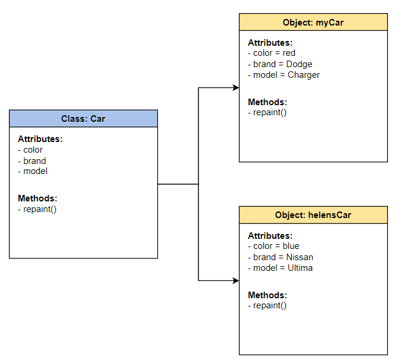
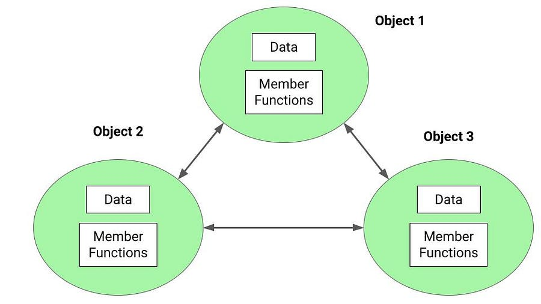
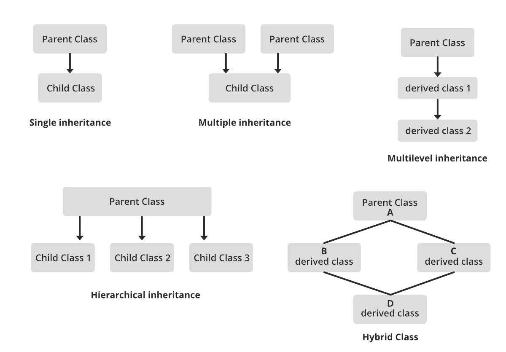

# Object-Oriented Programming (OOP)

## Table of Contents
<!-- TOC -->
* [Object-Oriented Programming (OOP)](#object-oriented-programming-oop)
  * [Table of Contents](#table-of-contents)
  * [OOP Concepts](#oop-concepts)
    * [Encapsulation](#encapsulation-)
    * [Inheritance](#inheritance-)
    * [Polymorphism](#polymorphism-)
      * [Static (Compile-time) Polymorphism:](#static-compile-time-polymorphism)
      * [Dynamic (Runtime) Polymorphism:](#dynamic-runtime-polymorphism)
    * [Abstraction](#abstraction-)
    * [Class](#class-)
    * [Object](#object-)
    * [Message Passing](#message-passing)
  * [OOP Languages](#oop-languages)
  * [Ref.](#ref)
<!-- TOC -->

___

Object-Oriented Programming (OOP) is a programming paradigm in computer science that relies on the concept of classes and objects. It is used to structure a software program into simple, reusable pieces of code blueprints (usually called classes), which are used to create individual instances of objects. There are many object-oriented programming languages, including JavaScript, C++, [Java](../languages/java/java.md#whats-oop), and Python.[^1]

[Back to top](#table-of-contents)

## OOP Concepts

The core concepts of object-oriented programming (OOP) include:

### Encapsulation 
Encapsulation is the principle of bundling data and the methods that operate on that data into a single unit called an object. It allows for data hiding and abstraction, ensuring that the internal representation and behavior of an object are hidden from the outside and can only be accessed through well-defined interfaces.

[Back to top](#table-of-contents)

### Inheritance 
Inheritance enables the creation of new classes (derived classes) based on existing classes (base or parent classes). Derived classes inherit properties and behaviors from their parent classes, allowing for code reuse and the creation of class hierarchies.

[Back to top](#table-of-contents)

### Polymorphism 
Polymorphism means the ability of objects to take on multiple forms or behave differently based on the context. It allows objects of different classes to be treated as instances of a common superclass, enabling flexibility and extensibility in code design.

There are two main types of polymorphism in object-oriented programming:

[Back to top](#table-of-contents)

#### Static (Compile-time) Polymorphism:
Static polymorphism is achieved through method overloading and operator overloading. 

- **Method overloading** allows multiple methods with the same name but different parameter types or a different number of parameters to coexist in a class. The appropriate method to execute is determined by the compiler based on the method's signature at compile-time. 

- **Operator overloading** (in some languages) enables the use of operators (such as +, -, *, /) with custom classes, defining their behavior according to the operands' types.

[Back to top](#table-of-contents)

#### Dynamic (Runtime) Polymorphism:
Dynamic polymorphism is achieved through method overriding and inheritance. Method overriding allows a subclass to provide a different implementation of a method that is already defined in its superclass. The decision on which implementation to execute is made at runtime based on the actual type of the object being referenced. This allows for the invocation of the appropriate method based on the specific object's type during runtime. Dynamic polymorphism is commonly associated with the "IS-A" relationship, where a subclass is considered an instance of its superclass.

[Back to top](#table-of-contents)

### Abstraction 
Abstraction involves focusing on essential characteristics and behavior while ignoring unnecessary details. It allows programmers to create abstract classes or interfaces that define a common set of properties and methods, without specifying their implementation. Abstraction helps in designing modular and maintainable code.

[Back to top](#table-of-contents)

### Class 
A class is a blueprint or template that defines the structure and behavior of objects. It encapsulates data (attributes) and methods (functions or operations) that manipulate that data. Objects are instances of classes.

[Back to top](#table-of-contents)

### Object 
An object is an instance of a class. It represents a particular entity with its own state (data) and behavior (methods). Objects interact with each other by invoking methods and exchanging messages.

[Back to top](#table-of-contents)

### Message Passing
In OOP, communication between objects occurs through message passing. Objects send messages to other objects to request or provide information, invoking the appropriate methods to carry out the desired actions.

[Back to top](#table-of-contents)

## OOP Languages

- [Java](oop-java.md)
- C++
- C#
- Python
- Ruby
- JavaScript
- PHP
- Swift
- Kotlin
- Objective-C
- Go
- TypeScript
- Scala
- Rust
- Perl
- Groovy
- R
- Dart
- Lua
- Smalltalk

[Back to top](#table-of-contents)

___

## Ref.

- https://www.geeksforgeeks.org/introduction-of-object-oriented-programming/
- https://www.enjoyalgorithms.com/blog/encapsulation-in-oops

[^1]: https://www.educative.io/blog/object-oriented-programming

___

[Index](../../common/get-started.md) |
[Java](../languages/java/java.md#whats-oop)

___